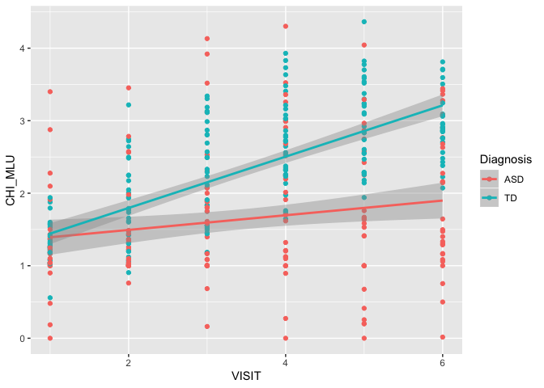
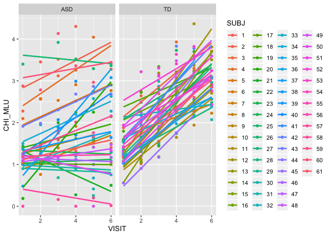
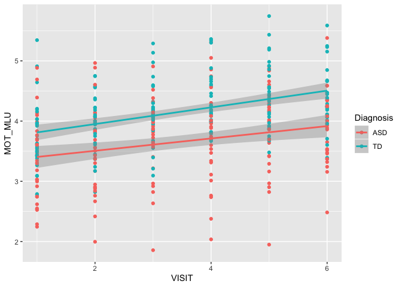
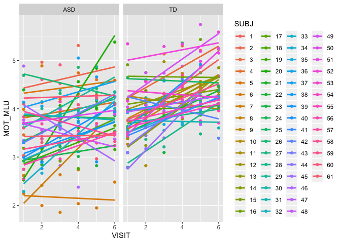
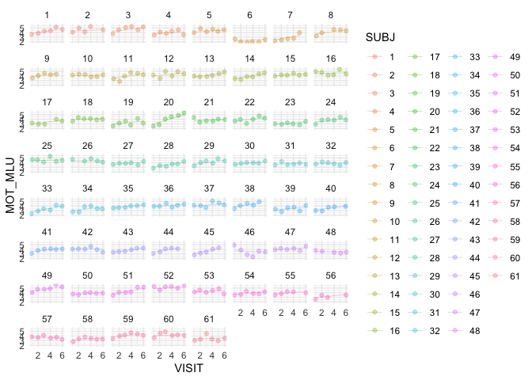

``` r
#knitr::opts_chunk$set(echo = TRUE)
#knitr::opts_chunk$set(include = FALSE)
```

Assignment 2
============

In this assignment you will have to discuss a few important questions (given the data you have). More details below. The assignment submitted to the teachers consists of: - a report answering and discussing the questions (so we can assess your conceptual understanding and ability to explain and critically reflect) - a link to a git repository with all the code (so we can assess your code)

Part 1 - Basic description of language development - Describe your sample (n, age, gender, clinical and cognitive features of the two groups) and critically assess whether the groups (ASD and TD) are balanced - Describe linguistic development (in terms of MLU over time) in TD and ASD children (as a function of group). - Describe how parental use of language (in terms of MLU) changes over time. What do you think is going on? - Include individual differences in your model of language development (in children). Identify the best model.

Part 2 - Model comparison - Discuss the differences in performance of your model in training and testing data - Which individual differences should be included in a model that maximizes your ability to explain/predict new data? - Predict a new kid's performance (Bernie) and discuss it against expected performance of the two groups

Part 3 - Simulations to plan a new study - Report and discuss a power analyses identifying how many new kids you would need to replicate the results

The following involves only Part 1.

Learning objectives
-------------------

-   Summarize and report data and models
-   Critically apply mixed effects (or multilevel) models
-   Explore the issues involved in feature selection

Quick recap
===========

Autism Spectrum Disorder is often related to language impairment. However, this phenomenon has not been empirically traced in detail: i) relying on actual naturalistic language production, ii) over extended periods of time.

We therefore videotaped circa 30 kids with ASD and circa 30 comparison kids (matched by linguistic performance at visit 1) for ca. 30 minutes of naturalistic interactions with a parent. We repeated the data collection 6 times per kid, with 4 months between each visit. We transcribed the data and counted: i) the amount of words that each kid uses in each video. Same for the parent. ii) the amount of unique words that each kid uses in each video. Same for the parent. iii) the amount of morphemes per utterance (Mean Length of Utterance) displayed by each child in each video. Same for the parent.

This data is in the file you prepared in the previous class.

NB. A few children have been excluded from your datasets. We will be using them next week to evaluate how good your models are in assessing the linguistic development in new participants.

This RMarkdown file includes 1) questions (see above). Questions have to be answered/discussed in a separate document that you have to directly send to the teachers. 2) A break down of the questions into a guided template full of hints for writing the code to solve the exercises. Fill in the code and the paragraphs as required. Then report your results in the doc for the teachers.

REMEMBER that you will have to have a github repository for the code and send the answers to Kenneth and Riccardo without code (but a link to your github/gitlab repository). This way we can check your code, but you are also forced to figure out how to report your analyses :-)

Before we get going, here is a reminder of the issues you will have to discuss in your report:

1- Describe your sample (n, age, gender, clinical and cognitive features of the two groups) and critically assess whether the groups (ASD and TD) are balanced 2- Describe linguistic development (in terms of MLU over time) in TD and ASD children (as a function of group). 3- Describe how parental use of language (in terms of MLU) changes over time. What do you think is going on? 4- Include individual differences in your model of language development (in children). Identify the best model.

Let's go
========

### Loading the relevant libraries

Load necessary libraries : what will you need? - e.g. something to deal with the data - e.g. mixed effects models - e.g. something to plot with

``` r
#load packages
library(pacman)
pacman::p_load(tidyverse, ggplot2, lme4, reshape2, MuMIn, afex, gridExtra)
```

### Define your working directory and load the data

If you created a project for this class and opened this Rmd file from within that project, your working directory is your project directory.

If you opened this Rmd file outside of a project, you will need some code to find the data: - Create a new variable called locpath (localpath) - Set it to be equal to your working directory - Move to that directory (setwd(locpath)) - Load the data you saved last time (use read\_csv(fileName))

``` r
df <- read.csv("assignment1df.csv")
```

### Characterize the participants (Exercise 1)

Identify relevant variables: participants demographic characteristics, diagnosis, ADOS, Verbal IQ, Non Verbal IQ, Socialization, Visit, Number of words used, Number of unique words used, mean length of utterance in both child and parents.

Make sure the variables are in the right format.

Describe the characteristics of the two groups of participants and whether the two groups are well matched.

``` r
#basic descriptive statistics of the whole data frame
df$SUBJ <- as.factor(df$SUBJ)
summary(df)
```

    ##        X               SUBJ         VISIT          MOT_MLU     
    ##  Min.   :  1.00   1      :  6   Min.   :1.000   Min.   :1.856  
    ##  1st Qu.: 88.75   3      :  6   1st Qu.:2.000   1st Qu.:3.513  
    ##  Median :176.50   4      :  6   Median :3.000   Median :3.971  
    ##  Mean   :176.50   5      :  6   Mean   :3.452   Mean   :3.918  
    ##  3rd Qu.:264.25   6      :  6   3rd Qu.:5.000   3rd Qu.:4.300  
    ##  Max.   :352.00   10     :  6   Max.   :6.000   Max.   :5.744  
    ##                   (Other):316                                  
    ##     CHI_MLU        types_MOT       types_CHI       tokens_MOT  
    ##  Min.   :0.000   Min.   : 74.0   Min.   :  0.0   Min.   : 209  
    ##  1st Qu.:1.204   1st Qu.:298.0   1st Qu.: 29.0   1st Qu.:1441  
    ##  Median :1.857   Median :352.5   Median :100.0   Median :1839  
    ##  Mean   :1.993   Mean   :354.5   Mean   :104.7   Mean   :1832  
    ##  3rd Qu.:2.758   3rd Qu.:410.0   3rd Qu.:163.2   3rd Qu.:2260  
    ##  Max.   :4.365   Max.   :601.0   Max.   :307.0   Max.   :3182  
    ##                                                                
    ##    tokens_CHI     Diagnosis            Ethnicity   Gender       Age       
    ##  Min.   :   0.0   ASD:166   White           :305   F: 57   Min.   :18.30  
    ##  1st Qu.: 138.5   TD :186   African American: 12   M:295   1st Qu.:28.55  
    ##  Median : 353.0             White/Latino    : 12           Median :35.91  
    ##  Mean   : 389.8             Asian           :  6           Mean   :36.52  
    ##  3rd Qu.: 586.5             White/Asian     :  6           3rd Qu.:42.99  
    ##  Max.   :1294.0             Bangladeshi     :  5           Max.   :62.40  
    ##                             (Other)         :  6           NA's   :6      
    ##       ADOS         nonVerbalIQ       verbalIQ     Socialization   
    ##  Min.   : 0.000   Min.   :13.00   Min.   : 8.00   Min.   : 38.00  
    ##  1st Qu.: 0.000   1st Qu.:27.00   1st Qu.:16.00   1st Qu.: 75.00  
    ##  Median : 5.000   Median :33.00   Median :22.00   Median : 94.00  
    ##  Mean   : 7.162   Mean   :34.71   Mean   :25.93   Mean   : 90.23  
    ##  3rd Qu.:14.000   3rd Qu.:43.00   3rd Qu.:36.00   3rd Qu.:103.00  
    ##  Max.   :25.000   Max.   :50.00   Max.   :50.00   Max.   :125.00  
    ##  NA's   :235      NA's   :178     NA's   :236     NA's   :2       
    ##      ADOS1         nonVerbalIQ1     verbalIQ1     Socialisation1  
    ##  Min.   : 0.000   Min.   :13.00   Min.   : 8.00   Min.   : 64.00  
    ##  1st Qu.: 0.000   1st Qu.:24.00   1st Qu.:14.00   1st Qu.: 76.75  
    ##  Median : 4.500   Median :27.00   Median :18.00   Median : 90.00  
    ##  Mean   : 7.136   Mean   :26.37   Mean   :18.84   Mean   : 89.43  
    ##  3rd Qu.:14.000   3rd Qu.:29.00   3rd Qu.:22.00   3rd Qu.:102.00  
    ##  Max.   :21.000   Max.   :42.00   Max.   :33.00   Max.   :115.00  
    ## 

``` r
#get the mean and standard deviations in a dataframe for ASD and TD seperately and only visit (1)
#only mean values
visit1mean <- subset(df, VISIT == "1") %>% 
  group_by(Diagnosis) %>%
  summarise (TotalNumber = n(), 
             Girls = sum(Gender == "F"), 
             Boys = sum(Gender == "M"), 
             Age = mean(Age, Na.RM = TRUE), 
             ADOS=mean(ADOS1), 
             VerbalIQ = mean(verbalIQ), 
             nonVerbalIQ = mean(nonVerbalIQ), 
             Socialization = mean(Socialization), 
             CHI_MLU = mean(CHI_MLU), 
             MOT_MLU = mean(MOT_MLU), 
             TokensChild = mean(tokens_CHI), 
             TokensMother = mean(tokens_MOT), 
             TypesChild=mean(types_CHI), 
             TypesMother=mean(types_MOT))

#only sd values
visit1SD <- subset(df, VISIT == "1") %>% 
  group_by(Diagnosis) %>%
  summarise (TotalNumber = NA, 
             Girls = NA, 
             Boys = NA, 
             Age = sd(Age), 
             ADOS=sd(ADOS1), 
             VerbalIQ = sd(verbalIQ), 
             nonVerbalIQ = sd(nonVerbalIQ), 
             Socialization = sd(Socialization), 
             CHI_MLU = sd(CHI_MLU), 
             MOT_MLU = sd(MOT_MLU), 
             TokensChild = sd(tokens_CHI), 
             TokensMother = sd(tokens_MOT), 
             TypesChild=sd(types_CHI), 
             TypesMother=sd(types_MOT))

#transpose
transposedVisit1mean <- t(visit1mean)
transposedVisit1SD <- t(visit1SD)

#merge and make pretty
totalframe <- cbind(transposedVisit1mean, transposedVisit1SD) #merge mean and sd
totalframe <- as.data.frame(totalframe)
totalframe1 <- subset(totalframe, select=c(1, 3, 2, 4)) #reorder
names(totalframe1) <- c("Mean", "SD", "Mean", "SD") #rename
totalframe1 <- as.data.frame(totalframe1)
#middle class

#save data frame as csv
write.csv(totalframe1, "totalframe1.csv", row.names = T)
```

The sample included mostly young (&lt;20) white males ...

\[REPORT THE RESULTS\]

Let's test hypothesis 1: Children with ASD display a language impairment (Exercise 2)
-------------------------------------------------------------------------------------

### Hypothesis: The child's MLU changes: i) over time, ii) according to diagnosis

Let's start with a simple mixed effects linear model

Remember to plot the data first and then to run a statistical test. - Which variable(s) should be included as fixed factors? - Which variable(s) should be included as random factors?

``` r
#make subject factor
df$SUBJ <- as.factor(df$SUBJ)

#ggplot: linear model by diagnosis for ASD and TD
ggplot(data = df, aes(x = VISIT, y = CHI_MLU, group = Diagnosis, colour = Diagnosis)) + 
  geom_point() + 
  geom_smooth(method = "lm")
```



``` r
#ggplot: linear model by diagnosis for each subject
ggplot(data = df, aes(x = VISIT, y = CHI_MLU, group = SUBJ, colour = SUBJ)) + 
  geom_point() + 
  geom_smooth(method = "lm", se = FALSE) + 
  facet_wrap(.~Diagnosis)
```



``` r
#different models 
#fixed effect of Diagnosis and Visit (and their interaction)
#random intercept for Child ID and random slope for children over the visit 
m0 <- lmer(CHI_MLU ~ 1 + (1|SUBJ) + (0+VISIT|SUBJ), data = df) #baseline 
m1 <- lmer(CHI_MLU ~ VISIT + Diagnosis + (1|SUBJ) + (0+VISIT|SUBJ), data = df) #without interaction
m2 <- lmer(CHI_MLU ~ VISIT*Diagnosis + (1|SUBJ) + (0+VISIT|SUBJ), data = df) #with interaction
summary(m2)
```

    ## Linear mixed model fit by REML. t-tests use Satterthwaite's method [
    ## lmerModLmerTest]
    ## Formula: CHI_MLU ~ VISIT * Diagnosis + (1 | SUBJ) + (0 + VISIT | SUBJ)
    ##    Data: df
    ## 
    ## REML criterion at convergence: 573.1
    ## 
    ## Scaled residuals: 
    ##      Min       1Q   Median       3Q      Max 
    ## -2.46505 -0.53585 -0.08606  0.45722  2.74469 
    ## 
    ## Random effects:
    ##  Groups   Name        Variance Std.Dev.
    ##  SUBJ     (Intercept) 0.27619  0.5255  
    ##  SUBJ.1   VISIT       0.01037  0.1019  
    ##  Residual             0.16356  0.4044  
    ## Number of obs: 352, groups:  SUBJ, 61
    ## 
    ## Fixed effects:
    ##                   Estimate Std. Error       df t value Pr(>|t|)    
    ## (Intercept)        1.30394    0.12054 76.20711  10.817  < 2e-16 ***
    ## VISIT              0.10058    0.02636 77.43234   3.816 0.000271 ***
    ## DiagnosisTD       -0.21553    0.16650 76.35192  -1.294 0.199410    
    ## VISIT:DiagnosisTD  0.25283    0.03652 78.13581   6.923 1.09e-09 ***
    ## ---
    ## Signif. codes:  0 '***' 0.001 '**' 0.01 '*' 0.05 '.' 0.1 ' ' 1
    ## 
    ## Correlation of Fixed Effects:
    ##             (Intr) VISIT  DgnsTD
    ## VISIT       -0.366              
    ## DiagnosisTD -0.724  0.265       
    ## VISIT:DgnTD  0.264 -0.722 -0.368

``` r
anova(m2)
```

    ## Type III Analysis of Variance Table with Satterthwaite's method
    ##                  Sum Sq Mean Sq NumDF  DenDF  F value    Pr(>F)    
    ## VISIT           25.2784 25.2784     1 78.136 154.5511 < 2.2e-16 ***
    ## Diagnosis        0.2741  0.2741     1 76.352   1.6756    0.1994    
    ## VISIT:Diagnosis  7.8399  7.8399     1 78.136  47.9325 1.094e-09 ***
    ## ---
    ## Signif. codes:  0 '***' 0.001 '**' 0.01 '*' 0.05 '.' 0.1 ' ' 1

How would you evaluate whether the model is a good model?

``` r
#compare models 
anova(m0, m1)
```

    ## refitting model(s) with ML (instead of REML)

    ## Data: df
    ## Models:
    ## m0: CHI_MLU ~ 1 + (1 | SUBJ) + (0 + VISIT | SUBJ)
    ## m1: CHI_MLU ~ VISIT + Diagnosis + (1 | SUBJ) + (0 + VISIT | SUBJ)
    ##    Df    AIC    BIC logLik deviance  Chisq Chi Df Pr(>Chisq)    
    ## m0  4 664.41 679.86 -328.2   656.41                             
    ## m1  6 606.99 630.18 -297.5   594.99 61.412      2   4.62e-14 ***
    ## ---
    ## Signif. codes:  0 '***' 0.001 '**' 0.01 '*' 0.05 '.' 0.1 ' ' 1

``` r
anova(m0, m2)
```

    ## refitting model(s) with ML (instead of REML)

    ## Data: df
    ## Models:
    ## m0: CHI_MLU ~ 1 + (1 | SUBJ) + (0 + VISIT | SUBJ)
    ## m2: CHI_MLU ~ VISIT * Diagnosis + (1 | SUBJ) + (0 + VISIT | SUBJ)
    ##    Df    AIC    BIC  logLik deviance  Chisq Chi Df Pr(>Chisq)    
    ## m0  4 664.41 679.86 -328.20   656.41                             
    ## m2  7 570.95 598.00 -278.47   556.95 99.456      3  < 2.2e-16 ***
    ## ---
    ## Signif. codes:  0 '***' 0.001 '**' 0.01 '*' 0.05 '.' 0.1 ' ' 1

``` r
anova(m1, m2)
```

    ## refitting model(s) with ML (instead of REML)

    ## Data: df
    ## Models:
    ## m1: CHI_MLU ~ VISIT + Diagnosis + (1 | SUBJ) + (0 + VISIT | SUBJ)
    ## m2: CHI_MLU ~ VISIT * Diagnosis + (1 | SUBJ) + (0 + VISIT | SUBJ)
    ##    Df    AIC    BIC  logLik deviance  Chisq Chi Df Pr(>Chisq)    
    ## m1  6 606.99 630.18 -297.50   594.99                             
    ## m2  7 570.95 598.00 -278.48   556.95 38.044      1  6.917e-10 ***
    ## ---
    ## Signif. codes:  0 '***' 0.001 '**' 0.01 '*' 0.05 '.' 0.1 ' ' 1

``` r
#calculate R2 or models 
MuMIn::r.squaredGLMM(m0)
```

    ## Warning: 'r.squaredGLMM' now calculates a revised statistic. See the help
    ## page.

    ##      R2m       R2c
    ## [1,]   0 0.8930461

``` r
MuMIn::r.squaredGLMM(m1)
```

    ##            R2m       R2c
    ## [1,] 0.1689929 0.8229437

``` r
MuMIn::r.squaredGLMM(m2)
```

    ##            R2m       R2c
    ## [1,] 0.3428856 0.8189115

Not too good, right? Let's check whether a growth curve model is better. Remember: a growth curve model assesses whether changes in time can be described by linear, or quadratic, or cubic (or... etc.) components. First build the different models, then compare them to see which one is better.

Exciting right? Let's check whether the model is doing an alright job at fitting the data. Plot the actual CHI\_MLU data against the predictions of the model fitted(model).

``` r
#df with predicted values from the data and the model
df1 <- df # put same values in new data frame
df1$fitted <- fitted(m2) #add new column with predicted values from model

#ggplot: predicted and acutal data, points are data, lines are predictions
ggplot(df1, aes(x = VISIT, y = CHI_MLU, group = SUBJ, color = SUBJ)) +
  geom_point(alpha = 0.3, position = position_jitter(w = 0.1, h = 0)) +
  facet_wrap(~SUBJ) +
  theme_minimal() +
  geom_smooth(method = "lm", se = FALSE, size = 0.1, aes(y=fitted))
```


Now it's time to report our results. Remember to report: - the estimates for each predictor (beta estimate, standard error, p-value) - A plain word description of the results - A plot of your model's predictions (and some comments on whether the predictions are sensible)

\[REPORT THE RESULTS\] Linguistic development of children MLU is affected by ... \[COMPLETE\]

Let's test hypothesis 2: Parents speak equally to children with ASD and TD (Exercise 3)
---------------------------------------------------------------------------------------

### Hypothesis: Parental MLU changes: i) over time, ii) according to diagnosis

``` r
### PLOTS ###
#ggplot: linear model of parent MLU by diagnosis and visit for ASD and TD
ggplot(df, aes(x=VISIT, y=MOT_MLU, color = Diagnosis)) +
  geom_point() +
  geom_smooth(method = "lm")
```



``` r
#mggplots: linear model of parent MLU by diagnosis and visit for single subject
ggplot(data = df, aes(x = VISIT, y = MOT_MLU, colour = SUBJ, group = SUBJ)) + 
  geom_point() + 
  geom_smooth(method = "lm", se = FALSE) + 
  facet_wrap(.~Diagnosis)
```



``` r
### MODELS ###
#models
MOT_m1 <- lmer(MOT_MLU ~ Diagnosis * VISIT + (1 + VISIT | SUBJ), data = df)
MOT_m2 <- lmer(MOT_MLU ~ Diagnosis + VISIT + (1 + VISIT | SUBJ), data = df)
anova(MOT_m1, MOT_m2) #m2 is better
```

    ## refitting model(s) with ML (instead of REML)

    ## Data: df
    ## Models:
    ## MOT_m2: MOT_MLU ~ Diagnosis + VISIT + (1 + VISIT | SUBJ)
    ## MOT_m1: MOT_MLU ~ Diagnosis * VISIT + (1 + VISIT | SUBJ)
    ##        Df    AIC    BIC  logLik deviance Chisq Chi Df Pr(>Chisq)
    ## MOT_m2  7 512.71 539.75 -249.35   498.71                        
    ## MOT_m1  8 513.48 544.39 -248.74   497.48 1.227      1      0.268

``` r
summary(MOT_m2)
```

    ## Linear mixed model fit by REML. t-tests use Satterthwaite's method [
    ## lmerModLmerTest]
    ## Formula: MOT_MLU ~ Diagnosis + VISIT + (1 + VISIT | SUBJ)
    ##    Data: df
    ## 
    ## REML criterion at convergence: 511.3
    ## 
    ## Scaled residuals: 
    ##      Min       1Q   Median       3Q      Max 
    ## -2.88957 -0.59049 -0.03341  0.53589  2.99032 
    ## 
    ## Random effects:
    ##  Groups   Name        Variance Std.Dev. Corr 
    ##  SUBJ     (Intercept) 0.34056  0.5836        
    ##           VISIT       0.01168  0.1081   -0.70
    ##  Residual             0.14724  0.3837        
    ## Number of obs: 352, groups:  SUBJ, 61
    ## 
    ## Fixed effects:
    ##             Estimate Std. Error       df t value Pr(>|t|)    
    ## (Intercept)  3.23804    0.10683 78.03786  30.310  < 2e-16 ***
    ## DiagnosisTD  0.50198    0.11523 58.92630   4.356 5.36e-05 ***
    ## VISIT        0.12026    0.01838 58.57598   6.542 1.65e-08 ***
    ## ---
    ## Signif. codes:  0 '***' 0.001 '**' 0.01 '*' 0.05 '.' 0.1 ' ' 1
    ## 
    ## Correlation of Fixed Effects:
    ##             (Intr) DgnsTD
    ## DiagnosisTD -0.568       
    ## VISIT       -0.624  0.003

``` r
#calculate R^2
MuMIn::r.squaredGLMM(MOT_m1)
```

    ##            R2m       R2c
    ## [1,] 0.2250589 0.6813521

``` r
MuMIn::r.squaredGLMM(MOT_m2) 
```

    ##            R2m       R2c
    ## [1,] 0.2258908 0.6815365

``` r
#almost the same for both 

### PREDICTIONS ###
#data frame with predicted values 
df2 <- df
df2$fitted <- fitted(MOT_m2)

#predicted and actual data, points are real data, lines are predictions
ggplot(df2, aes(x = VISIT, y = MOT_MLU, group = SUBJ, color = SUBJ)) +
  geom_point(alpha = 0.3, position = position_jitter(w = 0.1, h = 0)) +
  facet_wrap(~SUBJ) +
  theme_minimal() +
  geom_smooth(method = "lm", se = FALSE, size = 0.1, aes(y=fitted))
```



Parent MLU is affected by ... but probably not ... \[REPORT THE RESULTS\]

### Adding new variables (Exercise 4)

Your task now is to figure out how to best describe the children linguistic trajectory. The dataset contains a bunch of additional demographic, cognitive and clinical variables (e.g.verbal and non-verbal IQ). Try them out and identify the statistical models that best describes your data (that is, the children's MLU). Describe how you selected the best model and send the code to run the model to Riccardo and Kenneth

``` r
#create different models
mm0 <- lmer(CHI_MLU ~ 1 + (1|SUBJ) + (0+VISIT|SUBJ), data = df)
mm1 <- lmer(CHI_MLU ~ VISIT*Diagnosis +  (1|SUBJ) + (0+VISIT|SUBJ), data = df)
mm2 <- lmer(CHI_MLU ~ VISIT*Diagnosis + verbalIQ1 + (1|SUBJ) + (0+VISIT|SUBJ), data = df)
mm3 <- lmer(CHI_MLU ~ VISIT*Diagnosis + nonVerbalIQ1 +(1|SUBJ) + (0+VISIT|SUBJ), data = df)
mm4 <- lmer(CHI_MLU ~ VISIT*Diagnosis + MOT_MLU + (1|SUBJ) + (0+VISIT|SUBJ), data = df)
mm5 <- lmer(CHI_MLU ~ VISIT*Diagnosis + verbalIQ1 + MOT_MLU + (1|SUBJ) + (0+VISIT|SUBJ), data = df)
mm6 <- lmer(CHI_MLU ~ VISIT*Diagnosis + verbalIQ1*MOT_MLU + (1|SUBJ) + (0+VISIT|SUBJ), data = df)
mm7 <- lmer(CHI_MLU ~ VISIT*Diagnosis + verbalIQ1 + nonVerbalIQ1 +(1|SUBJ) + (0+VISIT|SUBJ), data = df)
mm8 <- lmer(CHI_MLU ~ VISIT*Diagnosis + verbalIQ1*nonVerbalIQ1 +(1|SUBJ) + (0+VISIT|SUBJ), data = df)
mm9 <- lmer(CHI_MLU ~ VISIT*Diagnosis + nonVerbalIQ1 + MOT_MLU +(1|SUBJ) + (0+VISIT|SUBJ), data = df)
mm10 <- lmer(CHI_MLU ~ VISIT*Diagnosis + nonVerbalIQ1*MOT_MLU + (1|SUBJ) + (0+VISIT|SUBJ), data = df)
#mm6 <- lmer(CHI_MLU ~ VISIT*Diagnosis*verbalIQ1*MOT_MLU + nonVerbalIQ1 + (1|SUBJ) + (0+VISIT|SUBJ), data = df)
#mm7 <- lmer(CHI_MLU ~ VISIT*Diagnosis + VISIT*verbalIQ1 + VISIT*ADOS1 + (1|SUBJ) + (0+VISIT|SUBJ), data = df)
#mm8 <- lmer(CHI_MLU ~ Diagnosis *verbalIQ1*(VISIT + VISIT^2) + (1|SUBJ) + (0+VISIT|SUBJ), data = df)
#mm9 <- lmer(CHI_MLU ~ Diagnosis*VISIT*verbalIQ1 + MOT_MLU*verbalIQ1 + (1+VISIT|SUBJ), data = df) #got model from function

#calculate R2
MuMIn::r.squaredGLMM(mm0)
```

    ##      R2m       R2c
    ## [1,]   0 0.8930461

``` r
MuMIn::r.squaredGLMM(mm1)
```

    ##            R2m       R2c
    ## [1,] 0.3428856 0.8189115

``` r
MuMIn::r.squaredGLMM(mm2)
```

    ##            R2m       R2c
    ## [1,] 0.6024114 0.8028278

``` r
MuMIn::r.squaredGLMM(mm3)
```

    ##            R2m       R2c
    ## [1,] 0.4581967 0.8109727

``` r
MuMIn::r.squaredGLMM(mm4)
```

    ##            R2m       R2c
    ## [1,] 0.4323686 0.8242866

``` r
MuMIn::r.squaredGLMM(mm5)
```

    ##            R2m       R2c
    ## [1,] 0.6503504 0.8210041

``` r
MuMIn::r.squaredGLMM(mm6) #best
```

    ##            R2m       R2c
    ## [1,] 0.6649786 0.8352019

``` r
MuMIn::r.squaredGLMM(mm7)
```

    ##            R2m       R2c
    ## [1,] 0.6003991 0.8035935

``` r
MuMIn::r.squaredGLMM(mm8)
```

    ##            R2m       R2c
    ## [1,] 0.6018297 0.8048714

``` r
MuMIn::r.squaredGLMM(mm9)
```

    ##            R2m       R2c
    ## [1,] 0.5176459 0.8258955

``` r
MuMIn::r.squaredGLMM(mm10)
```

    ##            R2m       R2c
    ## [1,] 0.5574426 0.8360632

``` r
anova(mm0, mm1, mm2, mm3, mm4, mm5, mm6, mm7, mm8, mm9, mm10)
```

    ## refitting model(s) with ML (instead of REML)

    ## Data: df
    ## Models:
    ## mm0: CHI_MLU ~ 1 + (1 | SUBJ) + (0 + VISIT | SUBJ)
    ## mm1: CHI_MLU ~ VISIT * Diagnosis + (1 | SUBJ) + (0 + VISIT | SUBJ)
    ## mm2: CHI_MLU ~ VISIT * Diagnosis + verbalIQ1 + (1 | SUBJ) + (0 + VISIT | 
    ## mm2:     SUBJ)
    ## mm3: CHI_MLU ~ VISIT * Diagnosis + nonVerbalIQ1 + (1 | SUBJ) + (0 + 
    ## mm3:     VISIT | SUBJ)
    ## mm4: CHI_MLU ~ VISIT * Diagnosis + MOT_MLU + (1 | SUBJ) + (0 + VISIT | 
    ## mm4:     SUBJ)
    ## mm5: CHI_MLU ~ VISIT * Diagnosis + verbalIQ1 + MOT_MLU + (1 | SUBJ) + 
    ## mm5:     (0 + VISIT | SUBJ)
    ## mm7: CHI_MLU ~ VISIT * Diagnosis + verbalIQ1 + nonVerbalIQ1 + (1 | 
    ## mm7:     SUBJ) + (0 + VISIT | SUBJ)
    ## mm9: CHI_MLU ~ VISIT * Diagnosis + nonVerbalIQ1 + MOT_MLU + (1 | SUBJ) + 
    ## mm9:     (0 + VISIT | SUBJ)
    ## mm6: CHI_MLU ~ VISIT * Diagnosis + verbalIQ1 * MOT_MLU + (1 | SUBJ) + 
    ## mm6:     (0 + VISIT | SUBJ)
    ## mm8: CHI_MLU ~ VISIT * Diagnosis + verbalIQ1 * nonVerbalIQ1 + (1 | 
    ## mm8:     SUBJ) + (0 + VISIT | SUBJ)
    ## mm10: CHI_MLU ~ VISIT * Diagnosis + nonVerbalIQ1 * MOT_MLU + (1 | SUBJ) + 
    ## mm10:     (0 + VISIT | SUBJ)
    ##      Df    AIC    BIC  logLik deviance   Chisq Chi Df Pr(>Chisq)    
    ## mm0   4 664.41 679.86 -328.20   656.41                              
    ## mm1   7 570.95 598.00 -278.47   556.95 99.4556      3  < 2.2e-16 ***
    ## mm2   8 515.79 546.70 -249.90   499.79 57.1547      1  4.028e-14 ***
    ## mm3   8 553.82 584.73 -268.91   537.82  0.0000      0          1    
    ## mm4   8 523.07 553.98 -253.53   507.07 30.7503      0  < 2.2e-16 ***
    ## mm5   9 471.32 506.09 -226.66   453.32 53.7476      1  2.280e-13 ***
    ## mm7   9 517.79 552.57 -249.90   499.79  0.0000      0          1    
    ## mm9   9 511.35 546.12 -246.67   493.35  6.4453      0  < 2.2e-16 ***
    ## mm6  10 457.21 495.84 -218.60   437.21 56.1402      1  6.748e-14 ***
    ## mm8  10 517.85 556.48 -248.92   497.85  0.0000      0          1    
    ## mm10 10 495.32 533.95 -237.66   475.32 22.5293      0  < 2.2e-16 ***
    ## ---
    ## Signif. codes:  0 '***' 0.001 '**' 0.01 '*' 0.05 '.' 0.1 ' ' 1

``` r
#m6 lowest AIC and BIC

#dredge package 
#two options, how you can go about it: 
#theory: think hard what you should use, before you collect the data, make a hard effort to say how language development works 
#lasso/elasticNet) take all relevant parameters: single effects and interactions, take all betas with some demand, divide all betas by the sum of them (fx 100), meaning a lot of betas will be close to 0, set a threshold (fx .1), any beta that is between -.1 and .1 is dropped, goes to 0, not big enough and exclude those variables, and continue until there is nothing below threshold, going by the data but also being strict #trying to avoid overfitting 
#pragmetic concerned: ethnicity could matter, very few of one group, what's the goal of the algorithm - want to predict their development, then we would put it types and MotMlu, but to just predict it, we don't want to put it in that takes just as much effort to calculate (then we can just take chi MLU), 
#depending on question you cut down the parameters differently 
```

In addition to ..., the MLU of the children is also correlated with ... Using AIC / nested F-tests as a criterium, we compared models of increasing complexity and found that ...

\[REPORT THE RESULTS\]
