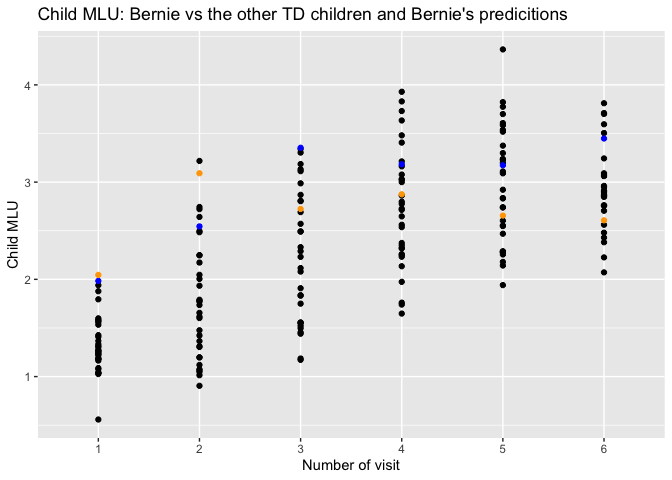

Welcome to the second exciting part of the Language Development in ASD exercise
-------------------------------------------------------------------------------

In this exercise we will delve more in depth with different practices of model comparison and model selection, by first evaluating your models from last time against some new data. Does the model generalize well? Then we will learn to do better by cross-validating models and systematically compare them.

The questions to be answered (in a separate document) are: 1- Discuss the differences in performance of your model in training and testing data 2- Which individual differences should be included in a model that maximizes your ability to explain/predict new data? 3- Predict a new kid's performance (Bernie) and discuss it against expected performance of the two groups

Learning objectives
-------------------

-   Critically appraise the predictive framework (contrasted to the explanatory framework)
-   Learn the basics of machine learning workflows: training/testing, cross-validation, feature selections

Let's go
--------

N.B. There are several datasets for this exercise, so pay attention to which one you are using!

1.  The (training) dataset from last time (the awesome one you produced :-) ).
2.  The (test) datasets on which you can test the models from last time:

-   Demographic and clinical data: <https://www.dropbox.com/s/ra99bdvm6fzay3g/demo_test.csv?dl=1>
-   Utterance Length data: <https://www.dropbox.com/s/uxtqqzl18nwxowq/LU_test.csv?dl=1>
-   Word data: <https://www.dropbox.com/s/1ces4hv8kh0stov/token_test.csv?dl=1>

### Exercise 1) Testing model performance

How did your models from last time perform? In this exercise you have to compare the results on the training data () and on the test data. Report both of them. Compare them. Discuss why they are different.

-   recreate the models you chose last time (just write the model code again and apply it to your training data (from the first assignment))
-   calculate performance of the model on the training data: root mean square error is a good measure. (Tip: google the function rmse())
-   create the test dataset (apply the code from assignment 1 to clean up the 3 test datasets)
-   test the performance of the models on the test data (Tips: google the functions "predict()")
-   optional: predictions are never certain, can you identify the uncertainty of the predictions? (e.g. google predictinterval())

``` r
#load packages
pacman::p_load(readr,dplyr,stringr,lmerTest,Metrics,caret,cvms, groupdata2, knitr, gridExtra)

## Clean up function, included to inspire you
CleanUpData <- function(Demo,LU,Word){
  
  Speech <- merge(LU, Word) %>% 
    rename(
      Child.ID = SUBJ, 
      Visit=VISIT) %>%
    mutate(
      Visit = as.numeric(str_extract(Visit, "\\d")),
      Child.ID = gsub("\\.","", Child.ID)
      ) %>%
    dplyr::select(
      Child.ID, Visit, MOT_MLU, CHI_MLU, types_MOT, types_CHI, tokens_MOT, tokens_CHI
    )
  
  Demo <- Demo %>%
    dplyr::select(
      Child.ID, Visit, Ethnicity, Diagnosis, Gender, Age, ADOS, MullenRaw, ExpressiveLangRaw, Socialization
    ) %>%
    mutate(
      Child.ID = gsub("\\.","", Child.ID)
    )
    
  Data=merge(Demo,Speech,all=T)
  
  Data1= Data %>% 
     subset(Visit=="1") %>% 
     dplyr::select(Child.ID, ADOS, ExpressiveLangRaw, MullenRaw, Socialization) %>%
     rename(Ados1 = ADOS, 
            verbalIQ1 = ExpressiveLangRaw, 
            nonVerbalIQ1 = MullenRaw,
            Socialization1 = Socialization) 
  
  Data=merge(Data, Data1, all=T) %>%
    mutate(
      Child.ID = as.numeric(as.factor(as.character(Child.ID))),
      Visit = as.numeric(as.character(Visit)),
      Gender = recode(Gender, 
         "1" = "M",
         "2" = "F"),
      Diagnosis = recode(Diagnosis,
         "A"  = "ASD",
         "B"  = "TD")
    )

  return(Data)
}

#### LOAD DATA ####
#train data
lu_train <- read.csv("LU_train.csv")
demo_train <- read.csv("demo_train.csv")
token_train <- read.csv("token_train.csv")
train_data1 <- CleanUpData(Demo = demo_train, LU = lu_train, Word = token_train)
train_data <- subset(train_data1, !is.na(CHI_MLU))


#test data
lu_test <- read.csv("LU_test.csv")
demo_test <- read.csv("demo_test.csv")
token_test <- read.csv("token_test.csv")
test_data1 <- CleanUpData(Demo = demo_test, LU = lu_test, Word = token_test)
test_data <- subset(test_data1, !is.na(CHI_MLU))

#### TEST PERFORMANCE OF MODEL ####
#use model from last time and apply to training data
train_model <- lmer(CHI_MLU ~ Visit*Diagnosis + verbalIQ1*MOT_MLU + (1|Child.ID) + (0+Visit|Child.ID), data = train_data)

#calculate perfomance of model on training data (root mean square error)
train_predict <- predict(train_model, train_data) #predict data from trained model and data
rmse(train_data$CHI_MLU, train_predict) #0.342, calculate differences and take the mean = average error
```

    ## [1] 0.3420218

``` r
#calculate performance of model on test data, 
test_predict <- predict(train_model, test_data, allow.new.levels = TRUE)
rmse(test_data$CHI_MLU, test_predict) #0.620, the others get 0.54, so we went with that one
```

    ## [1] 0.6205632

``` r
#rmse: if we only know the mena, how big of an error do we make? (sd), if rmse is smaller, that's better at least
#- optional: predictions are never certain, can you identify the uncertainty of the predictions? (e.g. google predictinterval())
```

\[HERE GOES YOUR ANSWER\]

### Exercise 2) Model Selection via Cross-validation (N.B: ChildMLU!)

One way to reduce bad surprises when testing a model on new data is to train the model via cross-validation.

In this exercise you have to use cross-validation to calculate the predictive error of your models and use this predictive error to select the best possible model.

-   Use cross-validation to compare your model from last week with the basic model (Child MLU as a function of Time and Diagnosis, and don't forget the random effects!)
-   (Tips): google the function "createFolds"; loop through each fold, train both models on the other folds and test them on the fold)

-   Now try to find the best possible predictive model of ChildMLU, that is, the one that produces the best cross-validated results.

-   Bonus Question 1: What is the effect of changing the number of folds? Can you plot RMSE as a function of number of folds?
-   Bonus Question 2: compare the cross-validated predictive error against the actual predictive error on the test data

``` r
#CV: split data into parts (often 5), take only one at a time as test data, train the model on the rest and then test it on the test set, repeat with every slice, gives 5 rmse, of which we can take the mean 
#can use it to choose among the models we are testing, look at sd and see how reliable it is (if slices are very different or not, can also mean that data is very different)

#R2 doesn't tell you that it's overfitting 
#Anova log likelihood, only telling you is the increase big enough but not are we being careful 
#AIC and BIC, only approximations of what we are doing 

#### PREP ####
#Kenneth function for convergenece issues
#lmerControl(optCtrl=list(xtol_abs=1e-8, ftol_abs=1e-8))

#### CV BASIC MODEL ####
#Create the basic model of ChildMLU as a function of Time and Diagnosis (don't forget the random effects!).
basic_model <- lmer(CHI_MLU ~ Visit + Diagnosis + (1|Child.ID) + (0+Visit|Child.ID), data = train_data)

#Make a cross-validated version of the model. (Tips: google the function "createFolds";  loop through each fold, train a model on the other folds and test it on the fold)
#fold data 
fold_data <- groupdata2::fold(train_data, k = 5,
             cat_col = 'Diagnosis',
             id_col = 'Child.ID') %>% 
             arrange(.folds) %>%
             mutate(CHI_MLU = scale(CHI_MLU))

#show first 15 rows of data
fold_data %>% head(15) %>% kable()
```

|  Child.ID|  Visit| Ethnicity    | Diagnosis | Gender |    Age|  ADOS|  MullenRaw|  ExpressiveLangRaw|  Socialization|  MOT\_MLU|    CHI\_MLU|  types\_MOT|  types\_CHI|  tokens\_MOT|  tokens\_CHI|  Ados1|  verbalIQ1|  nonVerbalIQ1|  Socialization1| .folds |
|---------:|------:|:-------------|:----------|:-------|------:|-----:|----------:|------------------:|--------------:|---------:|-----------:|-----------:|-----------:|------------:|------------:|------:|----------:|-------------:|---------------:|:-------|
|         5|      1| White/Latino | ASD       | M      |  31.03|     8|         31|                 27|             82|  3.459370|   0.0816450|         379|         102|         2009|          269|      8|         27|            31|              82| 1      |
|         5|      2| White/Latino | ASD       | M      |  35.30|    NA|         NA|                 NA|            115|  4.130337|   0.5884830|         343|         170|         1657|          555|      8|         27|            31|              82| 1      |
|         5|      3| White/Latino | ASD       | M      |  38.90|    NA|         NA|                 NA|             81|  3.818681|   1.6276651|         388|         165|         1788|          490|      8|         27|            31|              82| 1      |
|         5|      4| White/Latino | ASD       | M      |  43.13|    NA|         41|                 NA|             77|  4.301624|   1.3437490|         356|         163|         1711|          479|      8|         27|            31|              82| 1      |
|         5|      5| White/Latino | ASD       | M      |  47.40|     9|         NA|                 NA|             79|  4.602851|   2.1993568|         397|         146|         2082|          539|      8|         27|            31|              82| 1      |
|         5|      6| White/Latino | ASD       | M      |  51.37|    NA|         44|                 44|             74|  3.532374|   1.3666563|         410|         166|         2171|          738|      8|         27|            31|              82| 1      |
|         7|      1| Bangladeshi  | ASD       | F      |  26.17|    17|         20|                 17|             68|  2.618729|  -1.1122373|         212|           4|          761|           29|     17|         17|            20|              68| 1      |
|         7|      2| Bangladeshi  | ASD       | F      |  30.27|    NA|         NA|                 NA|             74|  1.995885|  -1.3726361|         140|          29|          464|          149|     17|         17|            20|              68| 1      |
|         7|      3| Bangledeshi  | ASD       | F      |  34.57|    NA|         NA|                 NA|             70|  1.856115|  -0.9274664|          74|          12|          250|           62|     17|         17|            20|              68| 1      |
|         7|      4| Bangladeshi  | ASD       | F      |  38.47|    NA|         33|                 NA|             66|  2.035714|  -0.3350264|         125|          50|          360|          205|     17|         17|            20|              68| 1      |
|         7|      5| Bangladeshi  | ASD       | F      |  42.43|     8|         NA|                 NA|             68|  1.948454|  -0.4198130|          92|          80|          209|          349|     17|         17|            20|              68| 1      |
|         7|      6| Bangladeshi  | ASD       | F      |  46.53|    NA|         39|                 26|             74|  2.483146|  -0.5717455|         158|          66|          536|          300|     17|         17|            20|              68| 1      |
|         8|      1| White        | ASD       | F      |  41.00|    18|         24|                 14|             65|  2.244755|  -0.8248159|         152|          29|          578|          130|     18|         14|            24|              65| 1      |
|         8|      2| White        | ASD       | F      |  49.20|    NA|         NA|                 NA|             63|  2.417344|  -0.7627760|         186|          42|          755|          169|     18|         14|            24|              65| 1      |
|         8|      3| White        | ASD       | F      |  49.20|    NA|         NA|                 NA|             63|  2.633929|  -0.6797892|         196|          50|          768|          210|     18|         14|            24|              65| 1      |

``` r
#cross-validate single model
CV1 <- cross_validate(fold_data, "CHI_MLU ~ Diagnosis + Visit + (1|Child.ID) + (0+Visit|Child.ID)",
                      fold_cols = '.folds',
                      family = 'gaussian',
                        control = lmerControl(
                          optimizer = "nloptwrap",
                          calc.dervis = FALSE, 
                          optCtrl = list(
                            xtol_abs = 1e-10,
                            xtol_abs = 1e-10,
                            maxeval = 1000000),
                      rm_nc = F,
                      REML = FALSE))
```

    ## Registered S3 method overwritten by 'MuMIn':
    ##   method         from
    ##   predict.merMod lme4

``` r
CV1 %>% select_metrics() %>% kable()
```

|       RMSE|        MAE|        r2m|        r2c|       AIC|      AICc|       BIC| Dependent | Fixed           | Random                          |
|----------:|----------:|----------:|----------:|---------:|---------:|---------:|:----------|:----------------|:--------------------------------|
|  0.8816057|  0.6985982|  0.1985533|  0.7909041|  551.9263|  552.2323|  573.7686| CHI\_MLU  | Diagnosis+Visit | (1|Child.ID)+(0+Visit|Child.ID) |

``` r
tableCV1 <- CV1[1:7]
tableCV1 <- round(tableCV1, digits = 3)
write.csv(tableCV1, "tableCV1.csv", row.names = F) #write to csv
  

#### CV MULTIPLE MODELS ####
#had to change random effect becasue it would not converge
mixed_models <- c("CHI_MLU ~ Diagnosis + (1 | Child.ID)",
                  "CHI_MLU ~ Visit + (1| Child.ID)",
                  "CHI_MLU ~ Visit + Diagnosis + (1 | Child.ID)", 
                  "CHI_MLU ~ Visit*Diagnosis + (1 | Child.ID)",
                  "CHI_MLU ~ Visit*Diagnosis + verbalIQ1 + (1 | Child.ID)",
                  "CHI_MLU ~ Visit*Diagnosis + verbalIQ1*MOT_MLU + (1 | Child.ID)",
                  "CHI_MLU ~ Visit*Diagnosis + verbalIQ1 + (1 | Child.ID)",
                  "CHI_MLU ~ Visit*Diagnosis + Ados1 + (1 | Child.ID)",
                  "CHI_MLU ~ Visit*Diagnosis + MOT_MLU + (1 | Child.ID)",
                  "CHI_MLU ~ Visit*Diagnosis + nonVerbalIQ1 +  (1 | Child.ID)",
                  "CHI_MLU ~ Visit*Diagnosis + nonVerbalIQ1 + verbalIQ1 + (1 | Child.ID)",
                  "CHI_MLU ~ Visit*Diagnosis + nonVerbalIQ1 + Ados1 + (1 | Child.ID)")
                  #"CHI_MLU ~ Diagnosis * Visit * verbalIQ1 + MOT_MLU * verbalIQ1 + (1 | Child.ID)", 
                  #"CHI_MLU ~ Diagnosis * Visit + nonVerbalIQ1 + verbalIQ1  + MOT_MLU + (1|Child.ID) ",
                  #"CHI_MLU ~ Diagnosis * Visit * Ados1 + MOT_MLU * Visit  + (1 | Child.ID)", 
                  #"CHI_MLU ~ Diagnosis * Visit * Ados1 * verbalIQ1  + (1 | Child.ID)",
                  #"CHI_MLU ~ Diagnosis * Visit  + MOT_MLU * verbalIQ1 + (1 | Child.ID)", 
                  #"CHI_MLU ~ Diagnosis * Visit * verbalIQ1 + MOT_MLU * Visit  + (1 | Child.ID)",
                  #"CHI_MLU ~ Diagnosis * Visit * Socialization1 + MOT_MLU * verbalIQ1  + (1 | Child.ID)") 


CV_mixed <- cross_validate(fold_data, mixed_models,
                      fold_cols = '.folds',
                      family = 'gaussian',
                        control = lmerControl(
                          optimizer = "nloptwrap",
                          calc.dervis = FALSE, 
                          optCtrl = list(
                            xtol_abs = 1e-10,
                            xtol_abs = 1e-10,
                            maxeval = 1000000),
                      rm_nc = F,
                      REML = FALSE))

CV_mixed %>% select_metrics() %>% kable()
```

|       RMSE|        MAE|        r2m|        r2c|       AIC|      AICc|       BIC| Dependent | Fixed                                   | Random       |
|----------:|----------:|----------:|----------:|---------:|---------:|---------:|:----------|:----------------------------------------|:-------------|
|  0.9252375|  0.7562118|  0.1492083|  0.4161343|  712.9271|  713.0717|  727.4887| CHI\_MLU  | Diagnosis                               | (1|Child.ID) |
|  0.8916912|  0.7077749|  0.2017953|  0.6612800|  604.6341|  604.7788|  619.1957| CHI\_MLU  | Visit                                   | (1|Child.ID) |
|  0.8180122|  0.6421205|  0.3505035|  0.6602473|  589.8709|  590.0886|  608.0728| CHI\_MLU  | Visit+Diagnosis                         | (1|Child.ID) |
|  0.7830034|  0.6141897|  0.4126399|  0.7342020|  534.8039|  535.1098|  556.6462| CHI\_MLU  | Visit\*Diagnosis                        | (1|Child.ID) |
|  0.6746894|  0.5234308|  0.5820707|  0.7333992|  506.7022|  507.1116|  532.1849| CHI\_MLU  | Visit\*Diagnosis+verbalIQ1              | (1|Child.ID) |
|  0.6470813|  0.4985191|  0.6320215|  0.7767039|  471.5796|  472.2425|  504.3431| CHI\_MLU  | Visit*Diagnosis+verbalIQ1*MOT\_MLU      | (1|Child.ID) |
|  0.6746894|  0.5234308|  0.5820707|  0.7333992|  506.7022|  507.1116|  532.1849| CHI\_MLU  | Visit\*Diagnosis+verbalIQ1              | (1|Child.ID) |
|  0.7533921|  0.5902935|  0.4604220|  0.7352463|  530.2895|  530.6989|  555.7722| CHI\_MLU  | Visit\*Diagnosis+Ados1                  | (1|Child.ID) |
|  0.7383722|  0.5784177|  0.4891753|  0.7628422|  498.3764|  498.7858|  523.8591| CHI\_MLU  | Visit\*Diagnosis+MOT\_MLU               | (1|Child.ID) |
|  0.7423569|  0.5762063|  0.4797657|  0.7345868|  527.1794|  527.5888|  552.6621| CHI\_MLU  | Visit\*Diagnosis+nonVerbalIQ1           | (1|Child.ID) |
|  0.6771471|  0.5256053|  0.5829786|  0.7332972|  508.4522|  508.9805|  537.5753| CHI\_MLU  | Visit\*Diagnosis+nonVerbalIQ1+verbalIQ1 | (1|Child.ID) |
|  0.7434633|  0.5811787|  0.4923874|  0.7352434|  527.2559|  527.7843|  556.3790| CHI\_MLU  | Visit\*Diagnosis+nonVerbalIQ1+Ados1     | (1|Child.ID) |

``` r
tableCV_mixed <- CV_mixed[,1:7]
tableCV_mixed <- round(tableCV_mixed, digits = 3)
write.csv(tableCV_mixed, "tableCVmix.csv", row.names = T)

#test 3 best models on test data? 

#- Report the results and comment on them. 
#- Now try to find the best possible predictive model of ChildMLU, that is, the one that produces the best cross-validated results.

# Bonus Question 1: What is the effect of changing the number of folds? Can you plot RMSE as a function of number of folds?
# Bonus Question 2: compare the cross-validated predictive error against the actual predictive error on the test data
```

\[HERE GOES YOUR ANSWER\]

### Exercise 3) Assessing the single child

Let's get to business. This new kiddo - Bernie - has entered your clinic. This child has to be assessed according to his group's average and his expected development.

Bernie is one of the six kids in the test dataset, so make sure to extract that child alone for the following analysis.

You want to evaluate:

-   how does the child fare in ChildMLU compared to the average TD child at each visit? Define the distance in terms of absolute difference between this Child and the average TD.

-   how does the child fare compared to the model predictions at Visit 6? Is the child below or above expectations? (tip: use the predict() function on Bernie's data only and compare the prediction with the actual performance of the child)

``` r
#get only bernies data
Bernie <- filter(test_data, Child.ID == "2")

TD_skills <- subset(train_data, Diagnosis == "TD") %>% group_by(Visit) %>% summarise(AverageTD = mean(CHI_MLU))
Bernie_skills <- subset(Bernie) %>% group_by(Visit) %>% summarize (Bernie = CHI_MLU)

#combine the 2 dataframes from above and add a column with the difference in total numbers
superior_Bernie <- merge(Bernie_skills, TD_skills)
superior_Bernie$Difference <- superior_Bernie$Bernie - superior_Bernie$AverageTD

#create model
THEmodel <- lmer(CHI_MLU ~ Diagnosis*Visit + verbalIQ1*MOT_MLU + (1|Child.ID), data = train_data)

#predict the values for each visit for Bernie
predictbernie <- predict(THEmodel, Bernie, allow.new.levels = TRUE)
#add predictions to dataframe
predict <- as.data.frame(predictbernie) 
predict$Visit <- c(1:6)
superior_Bernie$Predicted <- predictbernie
superior_Bernie <- round(superior_Bernie, digits = 2)
write.csv(superior_Bernie, "Bernie.csv") #get csv of all values

#ggplot: bernie, other kids, predictions
#plot: bernie vs the other TD kids 
td_kids_all <- filter(train_data, Diagnosis=="TD")
td_kids_all$Visit <- as.factor(td_kids_all$Visit)

ggplot()+
  geom_point(data=td_kids_all, aes(x=Visit, y=CHI_MLU, group=Visit), color = "black")+
  geom_point(data=Bernie, aes(x=Visit, y=CHI_MLU), colour = "blue")+
  geom_point(data=predict, aes(x = Visit, y=predictbernie), colour = "orange")+
  labs(x="Number of visit", y="Child MLU", title="Child MLU: Bernie vs the other TD children and Bernie's predicitions")+
  theme(legend.position = "right")
```



\[HERE GOES YOUR ANSWER\]

### OPTIONAL: Exercise 4) Model Selection via Information Criteria

Another way to reduce the bad surprises when testing a model on new data is to pay close attention to the relative information criteria between the models you are comparing. Let's learn how to do that!

Re-create a selection of possible models explaining ChildMLU (the ones you tested for exercise 2, but now trained on the full dataset and not cross-validated).

Then try to find the best possible predictive model of ChildMLU, that is, the one that produces the lowest information criterion.

-   Bonus question for the optional exercise: are information criteria correlated with cross-validated RMSE? That is, if you take AIC for Model 1, Model 2 and Model 3, do they co-vary with their cross-validated RMSE?

### OPTIONAL: Exercise 5): Using Lasso for model selection

Welcome to the last secret exercise. If you have already solved the previous exercises, and still there's not enough for you, you can expand your expertise by learning about penalizations. Check out this tutorial: <http://machinelearningmastery.com/penalized-regression-in-r/> and make sure to google what penalization is, with a focus on L1 and L2-norms. Then try them on your data!
