Welcome to the third exciting part of the Language Development in ASD exercise
------------------------------------------------------------------------------

In this part of the assignment, we try to figure out how a new study should be planned (i.e. how many participants?) in order to have enough power to replicate the findings (ensuring our sample size is adequate, our alpha at 0.05 and our beta at 0.8): 1- if we trust the estimates of the current study. Report the power analysis and comment on what you can (or cannot) use its estimates for. 2- if we are skeptical of the current study. Report the power analysis and comment on what you can (or cannot) use its estimates for. 3- if we only have access to 30 participants. Identify the power for each relevant effect and discuss whether it's worth to run the study and why The list above is also what you should discuss in your code-less report.

Learning objectives
-------------------

-   Learn how to calculate statistical power
-   Critically appraise how to apply frequentist statistical power

### Exercise 1

How much power does your study have (if your model estimates are quite right)? - Load your dataset (both training and testing), fit your favorite model, assess power for your effects of interest (probably your interactions). - Report the power analysis and comment on what you can (or cannot) use its estimates for. - Test how many participants you would have to have to replicate the findings (assuming the findings are correct)

N.B. Remember that main effects are tricky once you have interactions in the model (same for 2-way interactions w 3-way interactions in the model). If you want to test the power of main effects, run a model excluding the interactions. N.B. Check this paper: <https://besjournals.onlinelibrary.wiley.com/doi/full/10.1111/2041-210X.12504> You will be using: - powerSim() to calculate power - powerCurve() to estimate the needed number of participants - extend() to simulate more participants

``` r
##### PREP ######################################################

#load packages
library(githubinstall, pacman)
pacman::p_load(tidyverse, lmerTest, simr)
library(githubinstall)

## Clean up function, included to inspire you
CleanUpData <- function(Demo,LU,Word){
  
  Speech <- merge(LU, Word) %>% 
    rename(
      Child.ID = SUBJ, 
      Visit=VISIT) %>%
    mutate(
      Visit = as.numeric(str_extract(Visit, "\\d")),
      Child.ID = gsub("\\.","", Child.ID)
      ) %>%
    dplyr::select(
      Child.ID, Visit, MOT_MLU, CHI_MLU, types_MOT, types_CHI, tokens_MOT, tokens_CHI
    )
  
  Demo <- Demo %>%
    dplyr::select(
      Child.ID, Visit, Ethnicity, Diagnosis, Gender, Age, ADOS, MullenRaw, ExpressiveLangRaw, Socialization
    ) %>%
    mutate(
      Child.ID = gsub("\\.","", Child.ID)
    )
    
  Data=merge(Demo,Speech,all=T)
  
  Data1= Data %>% 
     subset(Visit=="1") %>% 
     dplyr::select(Child.ID, ADOS, ExpressiveLangRaw, MullenRaw, Socialization) %>%
     rename(Ados1 = ADOS, 
            verbalIQ1 = ExpressiveLangRaw, 
            nonVerbalIQ1 = MullenRaw,
            Socialization1 = Socialization) 
  
  Data=merge(Data, Data1, all=T) %>%
    mutate(
      Child.ID = as.numeric(as.factor(as.character(Child.ID))),
      Visit = as.numeric(as.character(Visit)),
      Gender = recode(Gender, 
         "1" = "M",
         "2" = "F"),
      Diagnosis = recode(Diagnosis,
         "A"  = "ASD",
         "B"  = "TD")
    )

  return(Data)
}


##### LOAD DATA ######################################################

#train data
lu_train <- read.csv("LU_train.csv")
demo_train <- read.csv("demo_train.csv")
token_train <- read.csv("token_train.csv")
train_data1 <- CleanUpData(Demo = demo_train, LU = lu_train, Word = token_train)
train_data <- subset(train_data1, !is.na(CHI_MLU))

#test data
lu_test <- read.csv("LU_test.csv")
demo_test <- read.csv("demo_test.csv")
token_test <- read.csv("token_test.csv")
test_data1 <- CleanUpData(Demo = demo_test, LU = lu_test, Word = token_test)
test_data <- subset(test_data1, !is.na(CHI_MLU))

#put two dataframes together 
test_data$Child.ID <- as.factor(test_data$Child.ID)
train_data$Child.ID <- as.factor(train_data$Child.ID)
levels(test_data$Child.ID) <- c(66:71)
data <- merge(train_data, test_data, all = TRUE)


##### CREATE MODELS ######################################################

#our model
THEmodel <- lmer(CHI_MLU ~ Visit*Diagnosis + verbalIQ1*MOT_MLU + (1|Child.ID), 
              data = data, REML = F,
              control = lmerControl(optimizer = "nloptwrap", calc.derivs = FALSE))

THEmodel1 <- lmer(CHI_MLU ~ Visit + Diagnosis + verbalIQ1 + MOT_MLU + (1|Child.ID), 
              data = data, REML = F,
              control = lmerControl(optimizer = "nloptwrap", calc.derivs = FALSE))

summary(THEmodel)
```

    ## Linear mixed model fit by maximum likelihood . t-tests use
    ##   Satterthwaite's method [lmerModLmerTest]
    ## Formula: 
    ## CHI_MLU ~ Visit * Diagnosis + verbalIQ1 * MOT_MLU + (1 | Child.ID)
    ##    Data: data
    ## Control: lmerControl(optimizer = "nloptwrap", calc.derivs = FALSE)
    ## 
    ##      AIC      BIC   logLik deviance df.resid 
    ##    529.6    565.3   -255.8    511.6      378 
    ## 
    ## Scaled residuals: 
    ##     Min      1Q  Median      3Q     Max 
    ## -3.3394 -0.5702  0.0154  0.5246  2.8560 
    ## 
    ## Random effects:
    ##  Groups   Name        Variance Std.Dev.
    ##  Child.ID (Intercept) 0.1023   0.3199  
    ##  Residual             0.1699   0.4121  
    ## Number of obs: 387, groups:  Child.ID, 66
    ## 
    ## Fixed effects:
    ##                     Estimate Std. Error         df t value Pr(>|t|)    
    ## (Intercept)         0.272957   0.563151 386.326132   0.485 0.628167    
    ## Visit               0.069927   0.018293 327.281381   3.823 0.000158 ***
    ## DiagnosisTD        -0.485949   0.126672 205.741568  -3.836 0.000166 ***
    ## verbalIQ1          -0.007211   0.030709 385.595820  -0.235 0.814478    
    ## MOT_MLU             0.007968   0.142114 382.961341   0.056 0.955319    
    ## Visit:DiagnosisTD   0.234251   0.024771 322.309779   9.457  < 2e-16 ***
    ## verbalIQ1:MOT_MLU   0.019073   0.007369 385.062828   2.588 0.010011 *  
    ## ---
    ## Signif. codes:  0 '***' 0.001 '**' 0.01 '*' 0.05 '.' 0.1 ' ' 1
    ## 
    ## Correlation of Fixed Effects:
    ##             (Intr) Visit  DgnsTD vrbIQ1 MOT_ML Vs:DTD
    ## Visit        0.003                                   
    ## DiagnosisTD  0.068  0.508                            
    ## verbalIQ1   -0.948 -0.047 -0.153                     
    ## MOT_MLU     -0.958 -0.130 -0.163  0.903              
    ## Vst:DgnssTD  0.031 -0.683 -0.670  0.069  0.040       
    ## vIQ1:MOT_ML  0.931  0.056  0.130 -0.971 -0.944 -0.067

``` r
##### TEST POWER ######################################################

#Visit:Diagnosis 
simVD = powerSim(THEmodel, fixed("Visit:Diagnosis"), nsim = 1000, seed = 1, progress = F)
```

    ## Warning in observedPowerWarning(sim): This appears to be an "observed
    ## power" calculation

``` r
simVD
```

    ## Power for predictor 'Visit:Diagnosis', (95% confidence interval):
    ##       100.0% (99.63, 100.0)
    ## 
    ## Test: unknown test
    ## 
    ## Based on 1000 simulations, (0 warnings, 0 errors)
    ## alpha = 0.05, nrow = 387
    ## 
    ## Time elapsed: 0 h 2 m 39 s
    ## 
    ## nb: result might be an observed power calculation

``` r
#100%

#verbalIQ1:MOT_MLU
simVeM = powerSim(THEmodel, fixed("verbalIQ1:MOT_MLU"), nsim = 1000, seed = 1, progress = F)
```

    ## Warning in observedPowerWarning(sim): This appears to be an "observed
    ## power" calculation

``` r
simVeM
```

    ## Power for predictor 'verbalIQ1:MOT_MLU', (95% confidence interval):
    ##       72.40% (69.52, 75.15)
    ## 
    ## Test: unknown test
    ##       Effect size for verbalIQ1:MOT_MLU is 0.019
    ## 
    ## Based on 1000 simulations, (0 warnings, 0 errors)
    ## alpha = 0.05, nrow = 387
    ## 
    ## Time elapsed: 0 h 2 m 30 s
    ## 
    ## nb: result might be an observed power calculation

``` r
#72.40%

#Visit
simV = powerSim(THEmodel1, fixed("Visit"), nsim = 1000, seed = 1, progress = F)
```

    ## Warning in observedPowerWarning(sim): This appears to be an "observed
    ## power" calculation

``` r
simV
```

    ## Power for predictor 'Visit', (95% confidence interval):
    ##       100.0% (99.63, 100.0)
    ## 
    ## Test: unknown test
    ##       Effect size for Visit is 0.19
    ## 
    ## Based on 1000 simulations, (0 warnings, 0 errors)
    ## alpha = 0.05, nrow = 387
    ## 
    ## Time elapsed: 0 h 2 m 30 s
    ## 
    ## nb: result might be an observed power calculation

``` r
#100%

#Diagnosis 
simD = powerSim(THEmodel1, fixed("Diagnosis"), nsim = 1000, seed = 1, progress = F)
```

    ## Warning in observedPowerWarning(sim): This appears to be an "observed
    ## power" calculation

``` r
simD
```

    ## Power for predictor 'Diagnosis', (95% confidence interval):
    ##       87.90% (85.72, 89.86)
    ## 
    ## Test: Likelihood ratio
    ## 
    ## Based on 1000 simulations, (0 warnings, 0 errors)
    ## alpha = 0.05, nrow = 387
    ## 
    ## Time elapsed: 0 h 1 m 7 s
    ## 
    ## nb: result might be an observed power calculation

``` r
#88%

#verbalIQ
simVe = powerSim(THEmodel1, fixed("verbalIQ1"), nsim = 1000, seed = 1, progress = F)
```

    ## Warning in observedPowerWarning(sim): This appears to be an "observed
    ## power" calculation

``` r
simVe
```

    ## Power for predictor 'verbalIQ1', (95% confidence interval):
    ##       100.0% (99.63, 100.0)
    ## 
    ## Test: unknown test
    ##       Effect size for verbalIQ1 is 0.069
    ## 
    ## Based on 1000 simulations, (0 warnings, 0 errors)
    ## alpha = 0.05, nrow = 387
    ## 
    ## Time elapsed: 0 h 2 m 23 s
    ## 
    ## nb: result might be an observed power calculation

``` r
#100%

#MOT_MLU
simM = powerSim(THEmodel1, fixed("MOT_MLU"), nsim = 1000, seed = 1, progress = F)
```

    ## Warning in observedPowerWarning(sim): This appears to be an "observed
    ## power" calculation

``` r
simM
```

    ## Power for predictor 'MOT_MLU', (95% confidence interval):
    ##       100.0% (99.63, 100.0)
    ## 
    ## Test: unknown test
    ##       Effect size for MOT_MLU is 0.39
    ## 
    ## Based on 1000 simulations, (0 warnings, 0 errors)
    ## alpha = 0.05, nrow = 387
    ## 
    ## Time elapsed: 0 h 2 m 25 s
    ## 
    ## nb: result might be an observed power calculation

``` r
#100%

##### HOW MANY PARTICIPANT NEEDED TO REPLICATE? ######################################################

#extendedmodel 
THEmodel_extend <- extend(THEmodel, along = "Child.ID", n = 100)
THEmodel1_extend <- extend(THEmodel1, along = "Child.ID", n = 100)

#Visit:Diagnosis
pc1 <- powerCurve(THEmodel, fixed("Visit:Diagnosis"), along = "Child.ID", nsim = 1000, breaks = seq(from = 5, to = 70, by = 5), seed = 1, progress = F)
```

    ## Warning in observedPowerWarning(sim): This appears to be an "observed
    ## power" calculation

``` r
pc1
```

    ## Power for predictor 'Visit:Diagnosis', (95% confidence interval),
    ## by number of levels in Child.ID:
    ##       5: 41.50% (38.43, 44.63) - 29 rows
    ##      10: 92.90% (91.13, 94.41) - 56 rows
    ##      15: 98.30% (97.29, 99.01) - 86 rows
    ##      20: 99.90% (99.44, 100.00) - 115 rows
    ##      25: 100.0% (99.63, 100.0) - 145 rows
    ##      30: 100.0% (99.63, 100.0) - 174 rows
    ##      35: 100.0% (99.63, 100.0) - 204 rows
    ##      40: 100.0% (99.63, 100.0) - 232 rows
    ##      45: 100.0% (99.63, 100.0) - 260 rows
    ##      50: 100.0% (99.63, 100.0) - 289 rows
    ##      55: 100.0% (99.63, 100.0) - 318 rows
    ##      60: 100.0% (99.63, 100.0) - 346 rows
    ##      65: 100.0% (99.63, 100.0) - 381 rows
    ##      NA: 100.0% (99.63, 100.0) - 387 rows
    ## 
    ## Time elapsed: 0 h 23 m 38 s

``` r
plot(pc1)
```

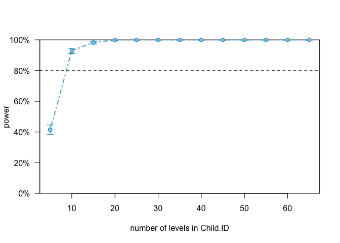

``` r
#around 9 participants

#verbalIQ1:MOT_MLU
pc2 <- powerCurve(THEmodel_extend, fixed("verbalIQ1:MOT_MLU"), along = "Child.ID", breaks = seq(from = 5, to = 100, by = 5), nsim = 1000, seed = 1, progress = F)
```

    ## Warning in observedPowerWarning(sim): This appears to be an "observed
    ## power" calculation

``` r
pc2
```

    ## Power for predictor 'verbalIQ1:MOT_MLU', (95% confidence interval),
    ## by number of levels in Child.ID:
    ##       5:  7.70% ( 6.12,  9.53) - 29 rows
    ##      10: 17.80% (15.48, 20.31) - 56 rows
    ##      15: 20.40% (17.94, 23.03) - 86 rows
    ##      20: 28.60% (25.82, 31.51) - 115 rows
    ##      25: 31.90% (29.02, 34.89) - 145 rows
    ##      30: 34.20% (31.26, 37.23) - 174 rows
    ##      35: 40.10% (37.05, 43.21) - 204 rows
    ##      40: 46.90% (43.77, 50.05) - 232 rows
    ##      45: 50.50% (47.35, 53.64) - 260 rows
    ##      50: 59.70% (56.59, 62.76) - 289 rows
    ##      55: 64.30% (61.24, 67.27) - 318 rows
    ##      60: 69.70% (66.75, 72.54) - 346 rows
    ##      65: 74.30% (71.47, 76.98) - 381 rows
    ##      70: 76.90% (74.16, 79.48) - 410 rows
    ##      75: 79.50% (76.86, 81.96) - 437 rows
    ##      80: 80.40% (77.80, 82.82) - 467 rows
    ##      85: 83.70% (81.26, 85.94) - 496 rows
    ##      90: 85.30% (82.95, 87.44) - 526 rows
    ##      95: 87.40% (85.18, 89.39) - 555 rows
    ##     100: 88.60% (86.47, 90.50) - 585 rows
    ## 
    ## Time elapsed: 0 h 39 m 50 s

``` r
plot(pc2)
```

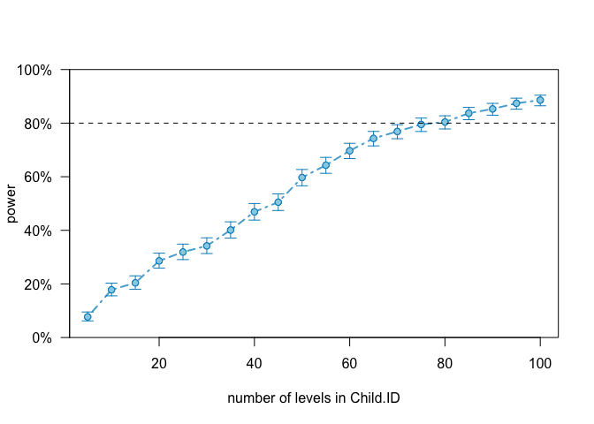

``` r
#around 75 participants

#Visit
pc3 <- powerCurve(THEmodel1, fixed("Visit"), along = "Child.ID", nsim = 1000, breaks = seq(from = 1, to =70, by = 5), seed = 1, progress = F)
```

    ## Warning in observedPowerWarning(sim): This appears to be an "observed
    ## power" calculation

``` r
pc3
```

    ## Power for predictor 'Visit', (95% confidence interval),
    ## by number of levels in Child.ID:
    ##       1:  0.00% ( 0.00,  0.37) - 6 rows
    ##       6: 93.70% (92.01, 95.13) - 35 rows
    ##      11: 99.70% (99.13, 99.94) - 62 rows
    ##      16: 100.0% (99.63, 100.0) - 92 rows
    ##      21: 100.0% (99.63, 100.0) - 121 rows
    ##      26: 100.0% (99.63, 100.0) - 150 rows
    ##      31: 100.0% (99.63, 100.0) - 180 rows
    ##      36: 100.0% (99.63, 100.0) - 210 rows
    ##      41: 100.0% (99.63, 100.0) - 238 rows
    ##      46: 100.0% (99.63, 100.0) - 266 rows
    ##      51: 100.0% (99.63, 100.0) - 295 rows
    ##      56: 100.0% (99.63, 100.0) - 322 rows
    ##      61: 100.0% (99.63, 100.0) - 357 rows
    ##      66: 100.0% (99.63, 100.0) - 387 rows
    ## 
    ## Time elapsed: 1 h 5 m 40 s

``` r
plot(pc3)
```

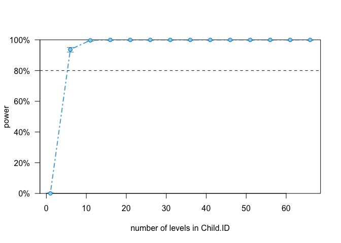

``` r
#around 7 participants

#Diagnosis
pc4 <- powerCurve(THEmodel1_extend, fixed("Diagnosis"), along = "Child.ID", nsim = 1000, breaks = seq(from = 1, to = 100, by = 5, progress = F), seed = 1)
```

    ## Warning: In seq.default(from = 1, to = 100, by = 5, progress = F) :
    ##  extra argument 'progress' will be disregarded

    ## Calculating power at 20 sample sizes along Child.ID

    ## Simulating: |                                                             |Simulating: |=                                                            |Simulating: |==                                                           |Simulating: |===                                                          |Simulating: |====                                                         |Simulating: |=====                                                        |Simulating: |======                                                       |Simulating: |=======                                                      |Simulating: |========                                                     |Simulating: |=========                                                    |Simulating: |==========                                                   |Simulating: |===========                                                  |Simulating: |============                                                 |Simulating: |=============                                                |Simulating: |==============                                               |Simulating: |===============                                              |Simulating: |================                                             |Simulating: |=================                                            |Simulating: |==================                                           |Simulating: |===================                                          |Simulating: |====================                                         |Simulating: |=====================                                        |Simulating: |======================                                       |Simulating: |=======================                                      |Simulating: |========================                                     |Simulating: |=========================                                    |Simulating: |==========================                                   |Simulating: |===========================                                  |Simulating: |============================                                 |Simulating: |=============================                                |Simulating: |==============================                               |Simulating: |===============================                              |Simulating: |================================                             |Simulating: |=================================                            |Simulating: |==================================                           |Simulating: |===================================                          |Simulating: |====================================                         |Simulating: |=====================================                        |Simulating: |======================================                       |Simulating: |=======================================                      |Simulating: |========================================                     |Simulating: |=========================================                    |Simulating: |==========================================                   |Simulating: |===========================================                  |Simulating: |============================================                 |Simulating: |=============================================                |Simulating: |==============================================               |Simulating: |===============================================              |Simulating: |================================================             |Simulating: |=================================================            |Simulating: |==================================================           |Simulating: |===================================================          |Simulating: |====================================================         |Simulating: |=====================================================        |Simulating: |======================================================       |Simulating: |=======================================================      |Simulating: |========================================================     |Simulating: |=========================================================    |Simulating: |==========================================================   |Simulating: |===========================================================  |Simulating: |============================================================ |Simulating: |=============================================================|( 1/20) ( 1/20) Simulating: |                                                     |( 1/20) Simulating: |=                                                    |( 1/20) Simulating: |==                                                   |( 1/20) Simulating: |===                                                  |( 1/20) Simulating: |====                                                 |( 1/20) Simulating: |=====                                                |( 1/20) Simulating: |======                                               |( 1/20) Simulating: |=======                                              |( 1/20) Simulating: |========                                             |( 1/20) Simulating: |=========                                            |( 1/20) Simulating: |==========                                           |( 1/20) Simulating: |===========                                          |( 1/20) Simulating: |============                                         |( 1/20) Simulating: |=============                                        |( 1/20) Simulating: |==============                                       |( 1/20) Simulating: |===============                                      |( 1/20) Simulating: |================                                     |( 1/20) Simulating: |=================                                    |( 1/20) Simulating: |==================                                   |( 1/20) Simulating: |===================                                  |( 1/20) Simulating: |====================                                 |( 1/20) Simulating: |=====================                                |( 1/20) Simulating: |======================                               |( 1/20) Simulating: |=======================                              |( 1/20) Simulating: |========================                             |( 1/20) Simulating: |=========================                            |( 1/20) Simulating: |==========================                           |( 1/20) Simulating: |===========================                          |( 1/20) Simulating: |============================                         |( 1/20) Simulating: |=============================                        |( 1/20) Simulating: |==============================                       |( 1/20) Simulating: |===============================                      |( 1/20) Simulating: |================================                     |( 1/20) Simulating: |=================================                    |( 1/20) Simulating: |==================================                   |( 1/20) Simulating: |===================================                  |( 1/20) Simulating: |====================================                 |( 1/20) Simulating: |=====================================                |( 1/20) Simulating: |======================================               |( 1/20) Simulating: |=======================================              |( 1/20) Simulating: |========================================             |( 1/20) Simulating: |=========================================            |( 1/20) Simulating: |==========================================           |( 1/20) Simulating: |===========================================          |( 1/20) Simulating: |============================================         |( 1/20) Simulating: |=============================================        |( 1/20) Simulating: |==============================================       |( 1/20) Simulating: |===============================================      |( 1/20) Simulating: |================================================     |( 1/20) Simulating: |=================================================    |( 1/20) Simulating: |==================================================   |( 1/20) Simulating: |===================================================  |( 1/20) Simulating: |==================================================== |( 1/20) Simulating: |=====================================================|( 1/20) ( 2/20) ( 2/20) Simulating: |                                                     |( 2/20) Simulating: |=                                                    |( 2/20) Simulating: |==                                                   |( 2/20) Simulating: |===                                                  |( 2/20) Simulating: |====                                                 |( 2/20) Simulating: |=====                                                |( 2/20) Simulating: |======                                               |( 2/20) Simulating: |=======                                              |( 2/20) Simulating: |========                                             |( 2/20) Simulating: |=========                                            |( 2/20) Simulating: |==========                                           |( 2/20) Simulating: |===========                                          |( 2/20) Simulating: |============                                         |( 2/20) Simulating: |=============                                        |( 2/20) Simulating: |==============                                       |( 2/20) Simulating: |===============                                      |( 2/20) Simulating: |================                                     |( 2/20) Simulating: |=================                                    |( 2/20) Simulating: |==================                                   |( 2/20) Simulating: |===================                                  |( 2/20) Simulating: |====================                                 |( 2/20) Simulating: |=====================                                |( 2/20) Simulating: |======================                               |( 2/20) Simulating: |=======================                              |( 2/20) Simulating: |========================                             |( 2/20) Simulating: |=========================                            |( 2/20) Simulating: |==========================                           |( 2/20) Simulating: |===========================                          |( 2/20) Simulating: |============================                         |( 2/20) Simulating: |=============================                        |( 2/20) Simulating: |==============================                       |( 2/20) Simulating: |===============================                      |( 2/20) Simulating: |================================                     |( 2/20) Simulating: |=================================                    |( 2/20) Simulating: |==================================                   |( 2/20) Simulating: |===================================                  |( 2/20) Simulating: |====================================                 |( 2/20) Simulating: |=====================================                |( 2/20) Simulating: |======================================               |( 2/20) Simulating: |=======================================              |( 2/20) Simulating: |========================================             |( 2/20) Simulating: |=========================================            |( 2/20) Simulating: |==========================================           |( 2/20) Simulating: |===========================================          |( 2/20) Simulating: |============================================         |( 2/20) Simulating: |=============================================        |( 2/20) Simulating: |==============================================       |( 2/20) Simulating: |===============================================      |( 2/20) Simulating: |================================================     |( 2/20) Simulating: |=================================================    |( 2/20) Simulating: |==================================================   |( 2/20) Simulating: |===================================================  |( 2/20) Simulating: |==================================================== |( 2/20) Simulating: |=====================================================|( 2/20) ( 3/20) ( 3/20) Simulating: |                                                     |( 3/20) Simulating: |=                                                    |( 3/20) Simulating: |==                                                   |( 3/20) Simulating: |===                                                  |( 3/20) Simulating: |====                                                 |( 3/20) Simulating: |=====                                                |( 3/20) Simulating: |======                                               |( 3/20) Simulating: |=======                                              |( 3/20) Simulating: |========                                             |( 3/20) Simulating: |=========                                            |( 3/20) Simulating: |==========                                           |( 3/20) Simulating: |===========                                          |( 3/20) Simulating: |============                                         |( 3/20) Simulating: |=============                                        |( 3/20) Simulating: |==============                                       |( 3/20) Simulating: |===============                                      |( 3/20) Simulating: |================                                     |( 3/20) Simulating: |=================                                    |( 3/20) Simulating: |==================                                   |( 3/20) Simulating: |===================                                  |( 3/20) Simulating: |====================                                 |( 3/20) Simulating: |=====================                                |( 3/20) Simulating: |======================                               |( 3/20) Simulating: |=======================                              |( 3/20) Simulating: |========================                             |( 3/20) Simulating: |=========================                            |( 3/20) Simulating: |==========================                           |( 3/20) Simulating: |===========================                          |( 3/20) Simulating: |============================                         |( 3/20) Simulating: |=============================                        |( 3/20) Simulating: |==============================                       |( 3/20) Simulating: |===============================                      |( 3/20) Simulating: |================================                     |( 3/20) Simulating: |=================================                    |( 3/20) Simulating: |==================================                   |( 3/20) Simulating: |===================================                  |( 3/20) Simulating: |====================================                 |( 3/20) Simulating: |=====================================                |( 3/20) Simulating: |======================================               |( 3/20) Simulating: |=======================================              |( 3/20) Simulating: |========================================             |( 3/20) Simulating: |=========================================            |( 3/20) Simulating: |==========================================           |( 3/20) Simulating: |===========================================          |( 3/20) Simulating: |============================================         |( 3/20) Simulating: |=============================================        |( 3/20) Simulating: |==============================================       |( 3/20) Simulating: |===============================================      |( 3/20) Simulating: |================================================     |( 3/20) Simulating: |=================================================    |( 3/20) Simulating: |==================================================   |( 3/20) Simulating: |===================================================  |( 3/20) Simulating: |==================================================== |( 3/20) Simulating: |=====================================================|( 3/20) ( 4/20) ( 4/20) Simulating: |                                                     |( 4/20) Simulating: |=                                                    |( 4/20) Simulating: |==                                                   |( 4/20) Simulating: |===                                                  |( 4/20) Simulating: |====                                                 |( 4/20) Simulating: |=====                                                |( 4/20) Simulating: |======                                               |( 4/20) Simulating: |=======                                              |( 4/20) Simulating: |========                                             |( 4/20) Simulating: |=========                                            |( 4/20) Simulating: |==========                                           |( 4/20) Simulating: |===========                                          |( 4/20) Simulating: |============                                         |( 4/20) Simulating: |=============                                        |( 4/20) Simulating: |==============                                       |( 4/20) Simulating: |===============                                      |( 4/20) Simulating: |================                                     |( 4/20) Simulating: |=================                                    |( 4/20) Simulating: |==================                                   |( 4/20) Simulating: |===================                                  |( 4/20) Simulating: |====================                                 |( 4/20) Simulating: |=====================                                |( 4/20) Simulating: |======================                               |( 4/20) Simulating: |=======================                              |( 4/20) Simulating: |========================                             |( 4/20) Simulating: |=========================                            |( 4/20) Simulating: |==========================                           |( 4/20) Simulating: |===========================                          |( 4/20) Simulating: |============================                         |( 4/20) Simulating: |=============================                        |( 4/20) Simulating: |==============================                       |( 4/20) Simulating: |===============================                      |( 4/20) Simulating: |================================                     |( 4/20) Simulating: |=================================                    |( 4/20) Simulating: |==================================                   |( 4/20) Simulating: |===================================                  |( 4/20) Simulating: |====================================                 |( 4/20) Simulating: |=====================================                |( 4/20) Simulating: |======================================               |( 4/20) Simulating: |=======================================              |( 4/20) Simulating: |========================================             |( 4/20) Simulating: |=========================================            |( 4/20) Simulating: |==========================================           |( 4/20) Simulating: |===========================================          |( 4/20) Simulating: |============================================         |( 4/20) Simulating: |=============================================        |( 4/20) Simulating: |==============================================       |( 4/20) Simulating: |===============================================      |( 4/20) Simulating: |================================================     |( 4/20) Simulating: |=================================================    |( 4/20) Simulating: |==================================================   |( 4/20) Simulating: |===================================================  |( 4/20) Simulating: |==================================================== |( 4/20) Simulating: |=====================================================|( 4/20) ( 5/20) ( 5/20) Simulating: |                                                     |( 5/20) Simulating: |=                                                    |( 5/20) Simulating: |==                                                   |( 5/20) Simulating: |===                                                  |( 5/20) Simulating: |====                                                 |( 5/20) Simulating: |=====                                                |( 5/20) Simulating: |======                                               |( 5/20) Simulating: |=======                                              |( 5/20) Simulating: |========                                             |( 5/20) Simulating: |=========                                            |( 5/20) Simulating: |==========                                           |( 5/20) Simulating: |===========                                          |( 5/20) Simulating: |============                                         |( 5/20) Simulating: |=============                                        |( 5/20) Simulating: |==============                                       |( 5/20) Simulating: |===============                                      |( 5/20) Simulating: |================                                     |( 5/20) Simulating: |=================                                    |( 5/20) Simulating: |==================                                   |( 5/20) Simulating: |===================                                  |( 5/20) Simulating: |====================                                 |( 5/20) Simulating: |=====================                                |( 5/20) Simulating: |======================                               |( 5/20) Simulating: |=======================                              |( 5/20) Simulating: |========================                             |( 5/20) Simulating: |=========================                            |( 5/20) Simulating: |==========================                           |( 5/20) Simulating: |===========================                          |( 5/20) Simulating: |============================                         |( 5/20) Simulating: |=============================                        |( 5/20) Simulating: |==============================                       |( 5/20) Simulating: |===============================                      |( 5/20) Simulating: |================================                     |( 5/20) Simulating: |=================================                    |( 5/20) Simulating: |==================================                   |( 5/20) Simulating: |===================================                  |( 5/20) Simulating: |====================================                 |( 5/20) Simulating: |=====================================                |( 5/20) Simulating: |======================================               |( 5/20) Simulating: |=======================================              |( 5/20) Simulating: |========================================             |( 5/20) Simulating: |=========================================            |( 5/20) Simulating: |==========================================           |( 5/20) Simulating: |===========================================          |( 5/20) Simulating: |============================================         |( 5/20) Simulating: |=============================================        |( 5/20) Simulating: |==============================================       |( 5/20) Simulating: |===============================================      |( 5/20) Simulating: |================================================     |( 5/20) Simulating: |=================================================    |( 5/20) Simulating: |==================================================   |( 5/20) Simulating: |===================================================  |( 5/20) Simulating: |==================================================== |( 5/20) Simulating: |=====================================================|( 5/20) ( 6/20) ( 6/20) Simulating: |                                                     |( 6/20) Simulating: |=                                                    |( 6/20) Simulating: |==                                                   |( 6/20) Simulating: |===                                                  |( 6/20) Simulating: |====                                                 |( 6/20) Simulating: |=====                                                |( 6/20) Simulating: |======                                               |( 6/20) Simulating: |=======                                              |( 6/20) Simulating: |========                                             |( 6/20) Simulating: |=========                                            |( 6/20) Simulating: |==========                                           |( 6/20) Simulating: |===========                                          |( 6/20) Simulating: |============                                         |( 6/20) Simulating: |=============                                        |( 6/20) Simulating: |==============                                       |( 6/20) Simulating: |===============                                      |( 6/20) Simulating: |================                                     |( 6/20) Simulating: |=================                                    |( 6/20) Simulating: |==================                                   |( 6/20) Simulating: |===================                                  |( 6/20) Simulating: |====================                                 |( 6/20) Simulating: |=====================                                |( 6/20) Simulating: |======================                               |( 6/20) Simulating: |=======================                              |( 6/20) Simulating: |========================                             |( 6/20) Simulating: |=========================                            |( 6/20) Simulating: |==========================                           |( 6/20) Simulating: |===========================                          |( 6/20) Simulating: |============================                         |( 6/20) Simulating: |=============================                        |( 6/20) Simulating: |==============================                       |( 6/20) Simulating: |===============================                      |( 6/20) Simulating: |================================                     |( 6/20) Simulating: |=================================                    |( 6/20) Simulating: |==================================                   |( 6/20) Simulating: |===================================                  |( 6/20) Simulating: |====================================                 |( 6/20) Simulating: |=====================================                |( 6/20) Simulating: |======================================               |( 6/20) Simulating: |=======================================              |( 6/20) Simulating: |========================================             |( 6/20) Simulating: |=========================================            |( 6/20) Simulating: |==========================================           |( 6/20) Simulating: |===========================================          |( 6/20) Simulating: |============================================         |( 6/20) Simulating: |=============================================        |( 6/20) Simulating: |==============================================       |( 6/20) Simulating: |===============================================      |( 6/20) Simulating: |================================================     |( 6/20) Simulating: |=================================================    |( 6/20) Simulating: |==================================================   |( 6/20) Simulating: |===================================================  |( 6/20) Simulating: |==================================================== |( 6/20) Simulating: |=====================================================|( 6/20) ( 7/20) ( 7/20) Simulating: |                                                     |( 7/20) Simulating: |=                                                    |( 7/20) Simulating: |==                                                   |( 7/20) Simulating: |===                                                  |( 7/20) Simulating: |====                                                 |( 7/20) Simulating: |=====                                                |( 7/20) Simulating: |======                                               |( 7/20) Simulating: |=======                                              |( 7/20) Simulating: |========                                             |( 7/20) Simulating: |=========                                            |( 7/20) Simulating: |==========                                           |( 7/20) Simulating: |===========                                          |( 7/20) Simulating: |============                                         |( 7/20) Simulating: |=============                                        |( 7/20) Simulating: |==============                                       |( 7/20) Simulating: |===============                                      |( 7/20) Simulating: |================                                     |( 7/20) Simulating: |=================                                    |( 7/20) Simulating: |==================                                   |( 7/20) Simulating: |===================                                  |( 7/20) Simulating: |====================                                 |( 7/20) Simulating: |=====================                                |( 7/20) Simulating: |======================                               |( 7/20) Simulating: |=======================                              |( 7/20) Simulating: |========================                             |( 7/20) Simulating: |=========================                            |( 7/20) Simulating: |==========================                           |( 7/20) Simulating: |===========================                          |( 7/20) Simulating: |============================                         |( 7/20) Simulating: |=============================                        |( 7/20) Simulating: |==============================                       |( 7/20) Simulating: |===============================                      |( 7/20) Simulating: |================================                     |( 7/20) Simulating: |=================================                    |( 7/20) Simulating: |==================================                   |( 7/20) Simulating: |===================================                  |( 7/20) Simulating: |====================================                 |( 7/20) Simulating: |=====================================                |( 7/20) Simulating: |======================================               |( 7/20) Simulating: |=======================================              |( 7/20) Simulating: |========================================             |( 7/20) Simulating: |=========================================            |( 7/20) Simulating: |==========================================           |( 7/20) Simulating: |===========================================          |( 7/20) Simulating: |============================================         |( 7/20) Simulating: |=============================================        |( 7/20) Simulating: |==============================================       |( 7/20) Simulating: |===============================================      |( 7/20) Simulating: |================================================     |( 7/20) Simulating: |=================================================    |( 7/20) Simulating: |==================================================   |( 7/20) Simulating: |===================================================  |( 7/20) Simulating: |==================================================== |( 7/20) Simulating: |=====================================================|( 7/20) ( 8/20) ( 8/20) Simulating: |                                                     |( 8/20) Simulating: |=                                                    |( 8/20) Simulating: |==                                                   |( 8/20) Simulating: |===                                                  |( 8/20) Simulating: |====                                                 |( 8/20) Simulating: |=====                                                |( 8/20) Simulating: |======                                               |( 8/20) Simulating: |=======                                              |( 8/20) Simulating: |========                                             |( 8/20) Simulating: |=========                                            |( 8/20) Simulating: |==========                                           |( 8/20) Simulating: |===========                                          |( 8/20) Simulating: |============                                         |( 8/20) Simulating: |=============                                        |( 8/20) Simulating: |==============                                       |( 8/20) Simulating: |===============                                      |( 8/20) Simulating: |================                                     |( 8/20) Simulating: |=================                                    |( 8/20) Simulating: |==================                                   |( 8/20) Simulating: |===================                                  |( 8/20) Simulating: |====================                                 |( 8/20) Simulating: |=====================                                |( 8/20) Simulating: |======================                               |( 8/20) Simulating: |=======================                              |( 8/20) Simulating: |========================                             |( 8/20) Simulating: |=========================                            |( 8/20) Simulating: |==========================                           |( 8/20) Simulating: |===========================                          |( 8/20) Simulating: |============================                         |( 8/20) Simulating: |=============================                        |( 8/20) Simulating: |==============================                       |( 8/20) Simulating: |===============================                      |( 8/20) Simulating: |================================                     |( 8/20) Simulating: |=================================                    |( 8/20) Simulating: |==================================                   |( 8/20) Simulating: |===================================                  |( 8/20) Simulating: |====================================                 |( 8/20) Simulating: |=====================================                |( 8/20) Simulating: |======================================               |( 8/20) Simulating: |=======================================              |( 8/20) Simulating: |========================================             |( 8/20) Simulating: |=========================================            |( 8/20) Simulating: |==========================================           |( 8/20) Simulating: |===========================================          |( 8/20) Simulating: |============================================         |( 8/20) Simulating: |=============================================        |( 8/20) Simulating: |==============================================       |( 8/20) Simulating: |===============================================      |( 8/20) Simulating: |================================================     |( 8/20) Simulating: |=================================================    |( 8/20) Simulating: |==================================================   |( 8/20) Simulating: |===================================================  |( 8/20) Simulating: |==================================================== |( 8/20) Simulating: |=====================================================|( 8/20) ( 9/20) ( 9/20) Simulating: |                                                     |( 9/20) Simulating: |=                                                    |( 9/20) Simulating: |==                                                   |( 9/20) Simulating: |===                                                  |( 9/20) Simulating: |====                                                 |( 9/20) Simulating: |=====                                                |( 9/20) Simulating: |======                                               |( 9/20) Simulating: |=======                                              |( 9/20) Simulating: |========                                             |( 9/20) Simulating: |=========                                            |( 9/20) Simulating: |==========                                           |( 9/20) Simulating: |===========                                          |( 9/20) Simulating: |============                                         |( 9/20) Simulating: |=============                                        |( 9/20) Simulating: |==============                                       |( 9/20) Simulating: |===============                                      |( 9/20) Simulating: |================                                     |( 9/20) Simulating: |=================                                    |( 9/20) Simulating: |==================                                   |( 9/20) Simulating: |===================                                  |( 9/20) Simulating: |====================                                 |( 9/20) Simulating: |=====================                                |( 9/20) Simulating: |======================                               |( 9/20) Simulating: |=======================                              |( 9/20) Simulating: |========================                             |( 9/20) Simulating: |=========================                            |( 9/20) Simulating: |==========================                           |( 9/20) Simulating: |===========================                          |( 9/20) Simulating: |============================                         |( 9/20) Simulating: |=============================                        |( 9/20) Simulating: |==============================                       |( 9/20) Simulating: |===============================                      |( 9/20) Simulating: |================================                     |( 9/20) Simulating: |=================================                    |( 9/20) Simulating: |==================================                   |( 9/20) Simulating: |===================================                  |( 9/20) Simulating: |====================================                 |( 9/20) Simulating: |=====================================                |( 9/20) Simulating: |======================================               |( 9/20) Simulating: |=======================================              |( 9/20) Simulating: |========================================             |( 9/20) Simulating: |=========================================            |( 9/20) Simulating: |==========================================           |( 9/20) Simulating: |===========================================          |( 9/20) Simulating: |============================================         |( 9/20) Simulating: |=============================================        |( 9/20) Simulating: |==============================================       |( 9/20) Simulating: |===============================================      |( 9/20) Simulating: |================================================     |( 9/20) Simulating: |=================================================    |( 9/20) Simulating: |==================================================   |( 9/20) Simulating: |===================================================  |( 9/20) Simulating: |==================================================== |( 9/20) Simulating: |=====================================================|( 9/20) (10/20) (10/20) Simulating: |                                                     |(10/20) Simulating: |=                                                    |(10/20) Simulating: |==                                                   |(10/20) Simulating: |===                                                  |(10/20) Simulating: |====                                                 |(10/20) Simulating: |=====                                                |(10/20) Simulating: |======                                               |(10/20) Simulating: |=======                                              |(10/20) Simulating: |========                                             |(10/20) Simulating: |=========                                            |(10/20) Simulating: |==========                                           |(10/20) Simulating: |===========                                          |(10/20) Simulating: |============                                         |(10/20) Simulating: |=============                                        |(10/20) Simulating: |==============                                       |(10/20) Simulating: |===============                                      |(10/20) Simulating: |================                                     |(10/20) Simulating: |=================                                    |(10/20) Simulating: |==================                                   |(10/20) Simulating: |===================                                  |(10/20) Simulating: |====================                                 |(10/20) Simulating: |=====================                                |(10/20) Simulating: |======================                               |(10/20) Simulating: |=======================                              |(10/20) Simulating: |========================                             |(10/20) Simulating: |=========================                            |(10/20) Simulating: |==========================                           |(10/20) Simulating: |===========================                          |(10/20) Simulating: |============================                         |(10/20) Simulating: |=============================                        |(10/20) Simulating: |==============================                       |(10/20) Simulating: |===============================                      |(10/20) Simulating: |================================                     |(10/20) Simulating: |=================================                    |(10/20) Simulating: |==================================                   |(10/20) Simulating: |===================================                  |(10/20) Simulating: |====================================                 |(10/20) Simulating: |=====================================                |(10/20) Simulating: |======================================               |(10/20) Simulating: |=======================================              |(10/20) Simulating: |========================================             |(10/20) Simulating: |=========================================            |(10/20) Simulating: |==========================================           |(10/20) Simulating: |===========================================          |(10/20) Simulating: |============================================         |(10/20) Simulating: |=============================================        |(10/20) Simulating: |==============================================       |(10/20) Simulating: |===============================================      |(10/20) Simulating: |================================================     |(10/20) Simulating: |=================================================    |(10/20) Simulating: |==================================================   |(10/20) Simulating: |===================================================  |(10/20) Simulating: |==================================================== |(10/20) Simulating: |=====================================================|(10/20) (11/20) (11/20) Simulating: |                                                     |(11/20) Simulating: |=                                                    |(11/20) Simulating: |==                                                   |(11/20) Simulating: |===                                                  |(11/20) Simulating: |====                                                 |(11/20) Simulating: |=====                                                |(11/20) Simulating: |======                                               |(11/20) Simulating: |=======                                              |(11/20) Simulating: |========                                             |(11/20) Simulating: |=========                                            |(11/20) Simulating: |==========                                           |(11/20) Simulating: |===========                                          |(11/20) Simulating: |============                                         |(11/20) Simulating: |=============                                        |(11/20) Simulating: |==============                                       |(11/20) Simulating: |===============                                      |(11/20) Simulating: |================                                     |(11/20) Simulating: |=================                                    |(11/20) Simulating: |==================                                   |(11/20) Simulating: |===================                                  |(11/20) Simulating: |====================                                 |(11/20) Simulating: |=====================                                |(11/20) Simulating: |======================                               |(11/20) Simulating: |=======================                              |(11/20) Simulating: |========================                             |(11/20) Simulating: |=========================                            |(11/20) Simulating: |==========================                           |(11/20) Simulating: |===========================                          |(11/20) Simulating: |============================                         |(11/20) Simulating: |=============================                        |(11/20) Simulating: |==============================                       |(11/20) Simulating: |===============================                      |(11/20) Simulating: |================================                     |(11/20) Simulating: |=================================                    |(11/20) Simulating: |==================================                   |(11/20) Simulating: |===================================                  |(11/20) Simulating: |====================================                 |(11/20) Simulating: |=====================================                |(11/20) Simulating: |======================================               |(11/20) Simulating: |=======================================              |(11/20) Simulating: |========================================             |(11/20) Simulating: |=========================================            |(11/20) Simulating: |==========================================           |(11/20) Simulating: |===========================================          |(11/20) Simulating: |============================================         |(11/20) Simulating: |=============================================        |(11/20) Simulating: |==============================================       |(11/20) Simulating: |===============================================      |(11/20) Simulating: |================================================     |(11/20) Simulating: |=================================================    |(11/20) Simulating: |==================================================   |(11/20) Simulating: |===================================================  |(11/20) Simulating: |==================================================== |(11/20) Simulating: |=====================================================|(11/20) (12/20) (12/20) Simulating: |                                                     |(12/20) Simulating: |=                                                    |(12/20) Simulating: |==                                                   |(12/20) Simulating: |===                                                  |(12/20) Simulating: |====                                                 |(12/20) Simulating: |=====                                                |(12/20) Simulating: |======                                               |(12/20) Simulating: |=======                                              |(12/20) Simulating: |========                                             |(12/20) Simulating: |=========                                            |(12/20) Simulating: |==========                                           |(12/20) Simulating: |===========                                          |(12/20) Simulating: |============                                         |(12/20) Simulating: |=============                                        |(12/20) Simulating: |==============                                       |(12/20) Simulating: |===============                                      |(12/20) Simulating: |================                                     |(12/20) Simulating: |=================                                    |(12/20) Simulating: |==================                                   |(12/20) Simulating: |===================                                  |(12/20) Simulating: |====================                                 |(12/20) Simulating: |=====================                                |(12/20) Simulating: |======================                               |(12/20) Simulating: |=======================                              |(12/20) Simulating: |========================                             |(12/20) Simulating: |=========================                            |(12/20) Simulating: |==========================                           |(12/20) Simulating: |===========================                          |(12/20) Simulating: |============================                         |(12/20) Simulating: |=============================                        |(12/20) Simulating: |==============================                       |(12/20) Simulating: |===============================                      |(12/20) Simulating: |================================                     |(12/20) Simulating: |=================================                    |(12/20) Simulating: |==================================                   |(12/20) Simulating: |===================================                  |(12/20) Simulating: |====================================                 |(12/20) Simulating: |=====================================                |(12/20) Simulating: |======================================               |(12/20) Simulating: |=======================================              |(12/20) Simulating: |========================================             |(12/20) Simulating: |=========================================            |(12/20) Simulating: |==========================================           |(12/20) Simulating: |===========================================          |(12/20) Simulating: |============================================         |(12/20) Simulating: |=============================================        |(12/20) Simulating: |==============================================       |(12/20) Simulating: |===============================================      |(12/20) Simulating: |================================================     |(12/20) Simulating: |=================================================    |(12/20) Simulating: |==================================================   |(12/20) Simulating: |===================================================  |(12/20) Simulating: |==================================================== |(12/20) Simulating: |=====================================================|(12/20) (13/20) (13/20) Simulating: |                                                     |(13/20) Simulating: |=                                                    |(13/20) Simulating: |==                                                   |(13/20) Simulating: |===                                                  |(13/20) Simulating: |====                                                 |(13/20) Simulating: |=====                                                |(13/20) Simulating: |======                                               |(13/20) Simulating: |=======                                              |(13/20) Simulating: |========                                             |(13/20) Simulating: |=========                                            |(13/20) Simulating: |==========                                           |(13/20) Simulating: |===========                                          |(13/20) Simulating: |============                                         |(13/20) Simulating: |=============                                        |(13/20) Simulating: |==============                                       |(13/20) Simulating: |===============                                      |(13/20) Simulating: |================                                     |(13/20) Simulating: |=================                                    |(13/20) Simulating: |==================                                   |(13/20) Simulating: |===================                                  |(13/20) Simulating: |====================                                 |(13/20) Simulating: |=====================                                |(13/20) Simulating: |======================                               |(13/20) Simulating: |=======================                              |(13/20) Simulating: |========================                             |(13/20) Simulating: |=========================                            |(13/20) Simulating: |==========================                           |(13/20) Simulating: |===========================                          |(13/20) Simulating: |============================                         |(13/20) Simulating: |=============================                        |(13/20) Simulating: |==============================                       |(13/20) Simulating: |===============================                      |(13/20) Simulating: |================================                     |(13/20) Simulating: |=================================                    |(13/20) Simulating: |==================================                   |(13/20) Simulating: |===================================                  |(13/20) Simulating: |====================================                 |(13/20) Simulating: |=====================================                |(13/20) Simulating: |======================================               |(13/20) Simulating: |=======================================              |(13/20) Simulating: |========================================             |(13/20) Simulating: |=========================================            |(13/20) Simulating: |==========================================           |(13/20) Simulating: |===========================================          |(13/20) Simulating: |============================================         |(13/20) Simulating: |=============================================        |(13/20) Simulating: |==============================================       |(13/20) Simulating: |===============================================      |(13/20) Simulating: |================================================     |(13/20) Simulating: |=================================================    |(13/20) Simulating: |==================================================   |(13/20) Simulating: |===================================================  |(13/20) Simulating: |==================================================== |(13/20) Simulating: |=====================================================|(13/20) (14/20) (14/20) Simulating: |                                                     |(14/20) Simulating: |=                                                    |(14/20) Simulating: |==                                                   |(14/20) Simulating: |===                                                  |(14/20) Simulating: |====                                                 |(14/20) Simulating: |=====                                                |(14/20) Simulating: |======                                               |(14/20) Simulating: |=======                                              |(14/20) Simulating: |========                                             |(14/20) Simulating: |=========                                            |(14/20) Simulating: |==========                                           |(14/20) Simulating: |===========                                          |(14/20) Simulating: |============                                         |(14/20) Simulating: |=============                                        |(14/20) Simulating: |==============                                       |(14/20) Simulating: |===============                                      |(14/20) Simulating: |================                                     |(14/20) Simulating: |=================                                    |(14/20) Simulating: |==================                                   |(14/20) Simulating: |===================                                  |(14/20) Simulating: |====================                                 |(14/20) Simulating: |=====================                                |(14/20) Simulating: |======================                               |(14/20) Simulating: |=======================                              |(14/20) Simulating: |========================                             |(14/20) Simulating: |=========================                            |(14/20) Simulating: |==========================                           |(14/20) Simulating: |===========================                          |(14/20) Simulating: |============================                         |(14/20) Simulating: |=============================                        |(14/20) Simulating: |==============================                       |(14/20) Simulating: |===============================                      |(14/20) Simulating: |================================                     |(14/20) Simulating: |=================================                    |(14/20) Simulating: |==================================                   |(14/20) Simulating: |===================================                  |(14/20) Simulating: |====================================                 |(14/20) Simulating: |=====================================                |(14/20) Simulating: |======================================               |(14/20) Simulating: |=======================================              |(14/20) Simulating: |========================================             |(14/20) Simulating: |=========================================            |(14/20) Simulating: |==========================================           |(14/20) Simulating: |===========================================          |(14/20) Simulating: |============================================         |(14/20) Simulating: |=============================================        |(14/20) Simulating: |==============================================       |(14/20) Simulating: |===============================================      |(14/20) Simulating: |================================================     |(14/20) Simulating: |=================================================    |(14/20) Simulating: |==================================================   |(14/20) Simulating: |===================================================  |(14/20) Simulating: |==================================================== |(14/20) Simulating: |=====================================================|(14/20) (15/20) (15/20) Simulating: |                                                     |(15/20) Simulating: |=                                                    |(15/20) Simulating: |==                                                   |(15/20) Simulating: |===                                                  |(15/20) Simulating: |====                                                 |(15/20) Simulating: |=====                                                |(15/20) Simulating: |======                                               |(15/20) Simulating: |=======                                              |(15/20) Simulating: |========                                             |(15/20) Simulating: |=========                                            |(15/20) Simulating: |==========                                           |(15/20) Simulating: |===========                                          |(15/20) Simulating: |============                                         |(15/20) Simulating: |=============                                        |(15/20) Simulating: |==============                                       |(15/20) Simulating: |===============                                      |(15/20) Simulating: |================                                     |(15/20) Simulating: |=================                                    |(15/20) Simulating: |==================                                   |(15/20) Simulating: |===================                                  |(15/20) Simulating: |====================                                 |(15/20) Simulating: |=====================                                |(15/20) Simulating: |======================                               |(15/20) Simulating: |=======================                              |(15/20) Simulating: |========================                             |(15/20) Simulating: |=========================                            |(15/20) Simulating: |==========================                           |(15/20) Simulating: |===========================                          |(15/20) Simulating: |============================                         |(15/20) Simulating: |=============================                        |(15/20) Simulating: |==============================                       |(15/20) Simulating: |===============================                      |(15/20) Simulating: |================================                     |(15/20) Simulating: |=================================                    |(15/20) Simulating: |==================================                   |(15/20) Simulating: |===================================                  |(15/20) Simulating: |====================================                 |(15/20) Simulating: |=====================================                |(15/20) Simulating: |======================================               |(15/20) Simulating: |=======================================              |(15/20) Simulating: |========================================             |(15/20) Simulating: |=========================================            |(15/20) Simulating: |==========================================           |(15/20) Simulating: |===========================================          |(15/20) Simulating: |============================================         |(15/20) Simulating: |=============================================        |(15/20) Simulating: |==============================================       |(15/20) Simulating: |===============================================      |(15/20) Simulating: |================================================     |(15/20) Simulating: |=================================================    |(15/20) Simulating: |==================================================   |(15/20) Simulating: |===================================================  |(15/20) Simulating: |==================================================== |(15/20) Simulating: |=====================================================|(15/20) (16/20) (16/20) Simulating: |                                                     |(16/20) Simulating: |=                                                    |(16/20) Simulating: |==                                                   |(16/20) Simulating: |===                                                  |(16/20) Simulating: |====                                                 |(16/20) Simulating: |=====                                                |(16/20) Simulating: |======                                               |(16/20) Simulating: |=======                                              |(16/20) Simulating: |========                                             |(16/20) Simulating: |=========                                            |(16/20) Simulating: |==========                                           |(16/20) Simulating: |===========                                          |(16/20) Simulating: |============                                         |(16/20) Simulating: |=============                                        |(16/20) Simulating: |==============                                       |(16/20) Simulating: |===============                                      |(16/20) Simulating: |================                                     |(16/20) Simulating: |=================                                    |(16/20) Simulating: |==================                                   |(16/20) Simulating: |===================                                  |(16/20) Simulating: |====================                                 |(16/20) Simulating: |=====================                                |(16/20) Simulating: |======================                               |(16/20) Simulating: |=======================                              |(16/20) Simulating: |========================                             |(16/20) Simulating: |=========================                            |(16/20) Simulating: |==========================                           |(16/20) Simulating: |===========================                          |(16/20) Simulating: |============================                         |(16/20) Simulating: |=============================                        |(16/20) Simulating: |==============================                       |(16/20) Simulating: |===============================                      |(16/20) Simulating: |================================                     |(16/20) Simulating: |=================================                    |(16/20) Simulating: |==================================                   |(16/20) Simulating: |===================================                  |(16/20) Simulating: |====================================                 |(16/20) Simulating: |=====================================                |(16/20) Simulating: |======================================               |(16/20) Simulating: |=======================================              |(16/20) Simulating: |========================================             |(16/20) Simulating: |=========================================            |(16/20) Simulating: |==========================================           |(16/20) Simulating: |===========================================          |(16/20) Simulating: |============================================         |(16/20) Simulating: |=============================================        |(16/20) Simulating: |==============================================       |(16/20) Simulating: |===============================================      |(16/20) Simulating: |================================================     |(16/20) Simulating: |=================================================    |(16/20) Simulating: |==================================================   |(16/20) Simulating: |===================================================  |(16/20) Simulating: |==================================================== |(16/20) Simulating: |=====================================================|(16/20) (17/20) (17/20) Simulating: |                                                     |(17/20) Simulating: |=                                                    |(17/20) Simulating: |==                                                   |(17/20) Simulating: |===                                                  |(17/20) Simulating: |====                                                 |(17/20) Simulating: |=====                                                |(17/20) Simulating: |======                                               |(17/20) Simulating: |=======                                              |(17/20) Simulating: |========                                             |(17/20) Simulating: |=========                                            |(17/20) Simulating: |==========                                           |(17/20) Simulating: |===========                                          |(17/20) Simulating: |============                                         |(17/20) Simulating: |=============                                        |(17/20) Simulating: |==============                                       |(17/20) Simulating: |===============                                      |(17/20) Simulating: |================                                     |(17/20) Simulating: |=================                                    |(17/20) Simulating: |==================                                   |(17/20) Simulating: |===================                                  |(17/20) Simulating: |====================                                 |(17/20) Simulating: |=====================                                |(17/20) Simulating: |======================                               |(17/20) Simulating: |=======================                              |(17/20) Simulating: |========================                             |(17/20) Simulating: |=========================                            |(17/20) Simulating: |==========================                           |(17/20) Simulating: |===========================                          |(17/20) Simulating: |============================                         |(17/20) Simulating: |=============================                        |(17/20) Simulating: |==============================                       |(17/20) Simulating: |===============================                      |(17/20) Simulating: |================================                     |(17/20) Simulating: |=================================                    |(17/20) Simulating: |==================================                   |(17/20) Simulating: |===================================                  |(17/20) Simulating: |====================================                 |(17/20) Simulating: |=====================================                |(17/20) Simulating: |======================================               |(17/20) Simulating: |=======================================              |(17/20) Simulating: |========================================             |(17/20) Simulating: |=========================================            |(17/20) Simulating: |==========================================           |(17/20) Simulating: |===========================================          |(17/20) Simulating: |============================================         |(17/20) Simulating: |=============================================        |(17/20) Simulating: |==============================================       |(17/20) Simulating: |===============================================      |(17/20) Simulating: |================================================     |(17/20) Simulating: |=================================================    |(17/20) Simulating: |==================================================   |(17/20) Simulating: |===================================================  |(17/20) Simulating: |==================================================== |(17/20) Simulating: |=====================================================|(17/20) (18/20) (18/20) Simulating: |                                                     |(18/20) Simulating: |=                                                    |(18/20) Simulating: |==                                                   |(18/20) Simulating: |===                                                  |(18/20) Simulating: |====                                                 |(18/20) Simulating: |=====                                                |(18/20) Simulating: |======                                               |(18/20) Simulating: |=======                                              |(18/20) Simulating: |========                                             |(18/20) Simulating: |=========                                            |(18/20) Simulating: |==========                                           |(18/20) Simulating: |===========                                          |(18/20) Simulating: |============                                         |(18/20) Simulating: |=============                                        |(18/20) Simulating: |==============                                       |(18/20) Simulating: |===============                                      |(18/20) Simulating: |================                                     |(18/20) Simulating: |=================                                    |(18/20) Simulating: |==================                                   |(18/20) Simulating: |===================                                  |(18/20) Simulating: |====================                                 |(18/20) Simulating: |=====================                                |(18/20) Simulating: |======================                               |(18/20) Simulating: |=======================                              |(18/20) Simulating: |========================                             |(18/20) Simulating: |=========================                            |(18/20) Simulating: |==========================                           |(18/20) Simulating: |===========================                          |(18/20) Simulating: |============================                         |(18/20) Simulating: |=============================                        |(18/20) Simulating: |==============================                       |(18/20) Simulating: |===============================                      |(18/20) Simulating: |================================                     |(18/20) Simulating: |=================================                    |(18/20) Simulating: |==================================                   |(18/20) Simulating: |===================================                  |(18/20) Simulating: |====================================                 |(18/20) Simulating: |=====================================                |(18/20) Simulating: |======================================               |(18/20) Simulating: |=======================================              |(18/20) Simulating: |========================================             |(18/20) Simulating: |=========================================            |(18/20) Simulating: |==========================================           |(18/20) Simulating: |===========================================          |(18/20) Simulating: |============================================         |(18/20) Simulating: |=============================================        |(18/20) Simulating: |==============================================       |(18/20) Simulating: |===============================================      |(18/20) Simulating: |================================================     |(18/20) Simulating: |=================================================    |(18/20) Simulating: |==================================================   |(18/20) Simulating: |===================================================  |(18/20) Simulating: |==================================================== |(18/20) Simulating: |=====================================================|(18/20) (19/20) (19/20) Simulating: |                                                     |(19/20) Simulating: |=                                                    |(19/20) Simulating: |==                                                   |(19/20) Simulating: |===                                                  |(19/20) Simulating: |====                                                 |(19/20) Simulating: |=====                                                |(19/20) Simulating: |======                                               |(19/20) Simulating: |=======                                              |(19/20) Simulating: |========                                             |(19/20) Simulating: |=========                                            |(19/20) Simulating: |==========                                           |(19/20) Simulating: |===========                                          |(19/20) Simulating: |============                                         |(19/20) Simulating: |=============                                        |(19/20) Simulating: |==============                                       |(19/20) Simulating: |===============                                      |(19/20) Simulating: |================                                     |(19/20) Simulating: |=================                                    |(19/20) Simulating: |==================                                   |(19/20) Simulating: |===================                                  |(19/20) Simulating: |====================                                 |(19/20) Simulating: |=====================                                |(19/20) Simulating: |======================                               |(19/20) Simulating: |=======================                              |(19/20) Simulating: |========================                             |(19/20) Simulating: |=========================                            |(19/20) Simulating: |==========================                           |(19/20) Simulating: |===========================                          |(19/20) Simulating: |============================                         |(19/20) Simulating: |=============================                        |(19/20) Simulating: |==============================                       |(19/20) Simulating: |===============================                      |(19/20) Simulating: |================================                     |(19/20) Simulating: |=================================                    |(19/20) Simulating: |==================================                   |(19/20) Simulating: |===================================                  |(19/20) Simulating: |====================================                 |(19/20) Simulating: |=====================================                |(19/20) Simulating: |======================================               |(19/20) Simulating: |=======================================              |(19/20) Simulating: |========================================             |(19/20) Simulating: |=========================================            |(19/20) Simulating: |==========================================           |(19/20) Simulating: |===========================================          |(19/20) Simulating: |============================================         |(19/20) Simulating: |=============================================        |(19/20) Simulating: |==============================================       |(19/20) Simulating: |===============================================      |(19/20) Simulating: |================================================     |(19/20) Simulating: |=================================================    |(19/20) Simulating: |==================================================   |(19/20) Simulating: |===================================================  |(19/20) Simulating: |==================================================== |(19/20) Simulating: |=====================================================|(19/20) (20/20) (20/20) Simulating: |                                                     |(20/20) Simulating: |=                                                    |(20/20) Simulating: |==                                                   |(20/20) Simulating: |===                                                  |(20/20) Simulating: |====                                                 |(20/20) Simulating: |=====                                                |(20/20) Simulating: |======                                               |(20/20) Simulating: |=======                                              |(20/20) Simulating: |========                                             |(20/20) Simulating: |=========                                            |(20/20) Simulating: |==========                                           |(20/20) Simulating: |===========                                          |(20/20) Simulating: |============                                         |(20/20) Simulating: |=============                                        |(20/20) Simulating: |==============                                       |(20/20) Simulating: |===============                                      |(20/20) Simulating: |================                                     |(20/20) Simulating: |=================                                    |(20/20) Simulating: |==================                                   |(20/20) Simulating: |===================                                  |(20/20) Simulating: |====================                                 |(20/20) Simulating: |=====================                                |(20/20) Simulating: |======================                               |(20/20) Simulating: |=======================                              |(20/20) Simulating: |========================                             |(20/20) Simulating: |=========================                            |(20/20) Simulating: |==========================                           |(20/20) Simulating: |===========================                          |(20/20) Simulating: |============================                         |(20/20) Simulating: |=============================                        |(20/20) Simulating: |==============================                       |(20/20) Simulating: |===============================                      |(20/20) Simulating: |================================                     |(20/20) Simulating: |=================================                    |(20/20) Simulating: |==================================                   |(20/20) Simulating: |===================================                  |(20/20) Simulating: |====================================                 |(20/20) Simulating: |=====================================                |(20/20) Simulating: |======================================               |(20/20) Simulating: |=======================================              |(20/20) Simulating: |========================================             |(20/20) Simulating: |=========================================            |(20/20) Simulating: |==========================================           |(20/20) Simulating: |===========================================          |(20/20) Simulating: |============================================         |(20/20) Simulating: |=============================================        |(20/20) Simulating: |==============================================       |(20/20) Simulating: |===============================================      |(20/20) Simulating: |================================================     |(20/20) Simulating: |=================================================    |(20/20) Simulating: |==================================================   |(20/20) Simulating: |===================================================  |(20/20) Simulating: |==================================================== |(20/20) Simulating: |=====================================================|(20/20) 

    ## Warning in observedPowerWarning(sim): This appears to be an "observed
    ## power" calculation

``` r
pc4
```

    ## Power for predictor 'Diagnosis', (95% confidence interval),
    ## by number of levels in Child.ID:
    ##       1:  0.00% ( 0.00,  0.37) - 6 rows
    ##       6: 14.90% (12.75, 17.26) - 35 rows
    ##      11: 25.00% (22.34, 27.81) - 62 rows
    ##      16: 26.40% (23.69, 29.25) - 92 rows
    ##      21: 39.80% (36.75, 42.91) - 121 rows
    ##      26: 47.80% (44.66, 50.95) - 150 rows
    ##      31: 55.70% (52.56, 58.81) - 180 rows
    ##      36: 60.20% (57.09, 63.25) - 210 rows
    ##      41: 65.80% (62.77, 68.74) - 238 rows
    ##      46: 72.20% (69.31, 74.96) - 266 rows
    ##      51: 75.20% (72.40, 77.85) - 295 rows
    ##      56: 77.20% (74.47, 79.77) - 322 rows
    ##      61: 83.10% (80.63, 85.37) - 357 rows
    ##      66: 85.70% (83.38, 87.81) - 387 rows
    ##      71: 89.20% (87.11, 91.06) - 416 rows
    ##      76: 90.40% (88.40, 92.15) - 443 rows
    ##      81: 92.30% (90.47, 93.88) - 473 rows
    ##      86: 93.60% (91.90, 95.04) - 502 rows
    ##      91: 95.10% (93.57, 96.35) - 532 rows
    ##      96: 95.80% (94.36, 96.96) - 561 rows
    ## 
    ## Time elapsed: 0 h 13 m 29 s

``` r
plot(pc4)
```

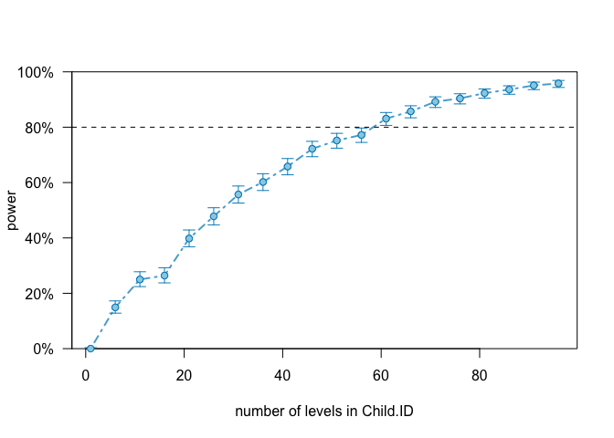

``` r
#around 60 participants

#verbalIQ1
pc5 <- powerCurve(THEmodel1, fixed("verbalIQ1"), along = "Child.ID", nsim = 1000, breaks = seq(from = 1, to = 70, by = 5), seed = 1, progress = F)
```

    ## Warning in observedPowerWarning(sim): This appears to be an "observed
    ## power" calculation

``` r
pc5
```

    ## Power for predictor 'verbalIQ1', (95% confidence interval),
    ## by number of levels in Child.ID:
    ##       1:  0.00% ( 0.00,  0.37) - 6 rows
    ##       6: 14.20% (12.09, 16.52) - 35 rows
    ##      11: 79.70% (77.07, 82.15) - 62 rows
    ##      16: 92.20% (90.36, 93.79) - 92 rows
    ##      21: 99.90% (99.44, 100.00) - 121 rows
    ##      26: 100.0% (99.63, 100.0) - 150 rows
    ##      31: 100.0% (99.63, 100.0) - 180 rows
    ##      36: 100.0% (99.63, 100.0) - 210 rows
    ##      41: 100.0% (99.63, 100.0) - 238 rows
    ##      46: 100.0% (99.63, 100.0) - 266 rows
    ##      51: 100.0% (99.63, 100.0) - 295 rows
    ##      56: 100.0% (99.63, 100.0) - 322 rows
    ##      61: 100.0% (99.63, 100.0) - 357 rows
    ##      66: 100.0% (99.63, 100.0) - 387 rows
    ## 
    ## Time elapsed: 0 h 54 m 2 s

``` r
plot(pc5)
```

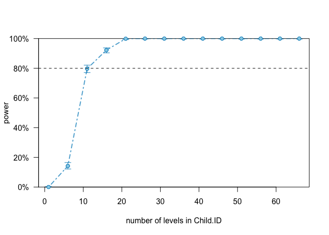

``` r
#around 9 participants

#MOT_MLU
pc6 <- powerCurve(THEmodel1, fixed("MOT_MLU"), along = "Child.ID", nsim = 1000, breaks = seq(from = 1, to = 70, by = 5), seed = 1, progress = F)
```

    ## Warning in observedPowerWarning(sim): This appears to be an "observed
    ## power" calculation

``` r
pc6
```

    ## Power for predictor 'MOT_MLU', (95% confidence interval),
    ## by number of levels in Child.ID:
    ##       1:  0.00% ( 0.00,  0.37) - 6 rows
    ##       6: 45.00% (41.89, 48.14) - 35 rows
    ##      11: 87.50% (85.29, 89.49) - 62 rows
    ##      16: 94.40% (92.79, 95.74) - 92 rows
    ##      21: 99.20% (98.43, 99.65) - 121 rows
    ##      26: 99.90% (99.44, 100.00) - 150 rows
    ##      31: 99.90% (99.44, 100.00) - 180 rows
    ##      36: 100.0% (99.63, 100.0) - 210 rows
    ##      41: 100.0% (99.63, 100.0) - 238 rows
    ##      46: 100.0% (99.63, 100.0) - 266 rows
    ##      51: 100.0% (99.63, 100.0) - 295 rows
    ##      56: 100.0% (99.63, 100.0) - 322 rows
    ##      61: 100.0% (99.63, 100.0) - 357 rows
    ##      66: 100.0% (99.63, 100.0) - 387 rows
    ## 
    ## Time elapsed: 0 h 46 m 48 s

``` r
plot(pc6)
```

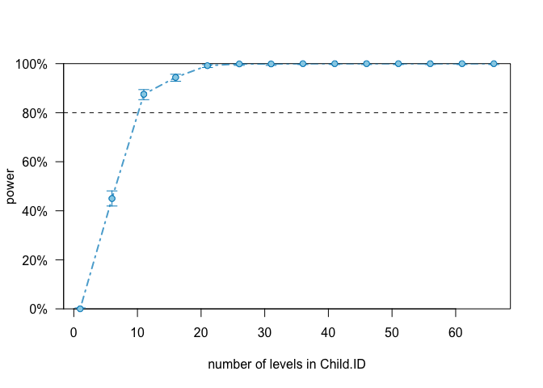

``` r
#around 9 participants
```

### Exercise 2

How would you perform a more conservative power analysis? - Identify and justify a minimum effect size for each of your relevant effects - take the model from exercise 1 and replace the effects with the minimum effect size that you'd accept. - assess the power curve by Child.ID, identifying an ideal number of participants to estimate each effect - if your power estimates do not reach an acceptable threshold simulate additional participants and repeat the previous analysis - Report the power analysis and comment on what you can (or cannot) use its estimates for.

``` r
#### SET MINIMUM EFFECT ####
#current effect sizes for the effects 
fixef(THEmodel)["Visit:DiagnosisTD"] #0.23
```

    ## Visit:DiagnosisTD 
    ##         0.2342508

``` r
fixef(THEmodel)["verbalIQ1:MOT_MLU"] #0.019
```

    ## verbalIQ1:MOT_MLU 
    ##        0.01907317

``` r
fixef(THEmodel1)["Visit"] # 0.187
```

    ##     Visit 
    ## 0.1874267

``` r
fixef(THEmodel1)["DiagnosisTD"] #0.28
```

    ## DiagnosisTD 
    ##    0.283271

``` r
fixef(THEmodel1)["verbalIQ1"] #0.069
```

    ##  verbalIQ1 
    ## 0.06871417

``` r
fixef(THEmodel1)["MOT_MLU"] #0.387
```

    ##   MOT_MLU 
    ## 0.3867428

``` r
#get sd and 20% of it
sd(data$CHI_MLU) #20% of sd (0.92) = 0.18
```

    ## [1] 0.9282516

``` r
#create models again to change the effects in them 
THEmodel_fix <- lmer(CHI_MLU ~ Visit*Diagnosis + verbalIQ1*MOT_MLU + (1|Child.ID), 
              data = data, REML = F,
              control = lmerControl(optimizer = "nloptwrap", calc.derivs = FALSE))

THEmodel1_fix <- lmer(CHI_MLU ~ Visit + Diagnosis + verbalIQ1 + MOT_MLU + (1|Child.ID), 
              data = data, REML = F,
              control = lmerControl(optimizer = "nloptwrap", calc.derivs = FALSE))

#replace minimum effect sizes 
fixef(THEmodel_fix)["Visit:DiagnosisTD"] = 0.2
fixef(THEmodel_fix)["verbalIQ1:MOT_MLU"] = 0.015 #is this even relevant then? 
fixef(THEmodel1_fix)["Visit"] = 0.15
fixef(THEmodel1_fix)["DiagnosisTD"] = 0.25
fixef(THEmodel1_fix)["verbalIQ1"] = 0.05
fixef(THEmodel1_fix)["MOT_MLU"] = 0.3

#extend 
THEmodel_fix_extend <- extend(THEmodel_fix, along = "Child.ID", n = 150)
THEmodel1_fix_extend <- extend(THEmodel1_fix, along = "Child.ID", n = 150)

#Visit:Diagnosis
pc1.1 <- powerCurve(THEmodel_fix, fixed("Visit:Diagnosis"), along = "Child.ID", nsim = 1000, breaks = seq(from = 1, to = 70, by = 5), seed = 1, progress = F)
pc1.1
```

    ## Power for predictor 'Visit:Diagnosis', (95% confidence interval),
    ## by number of levels in Child.ID:
    ##       1:  0.00% ( 0.00,  0.37) - 6 rows
    ##       6: 35.30% (32.33, 38.35) - 35 rows
    ##      11: 86.80% (84.54, 88.84) - 62 rows
    ##      16: 94.20% (92.57, 95.57) - 92 rows
    ##      21: 99.30% (98.56, 99.72) - 121 rows
    ##      26: 99.90% (99.44, 100.00) - 150 rows
    ##      31: 100.0% (99.63, 100.0) - 180 rows
    ##      36: 100.0% (99.63, 100.0) - 210 rows
    ##      41: 100.0% (99.63, 100.0) - 238 rows
    ##      46: 100.0% (99.63, 100.0) - 266 rows
    ##      51: 100.0% (99.63, 100.0) - 295 rows
    ##      56: 100.0% (99.63, 100.0) - 322 rows
    ##      61: 100.0% (99.63, 100.0) - 357 rows
    ##      66: 100.0% (99.63, 100.0) - 387 rows
    ## 
    ## Time elapsed: 0 h 36 m 40 s

``` r
plot(pc1.1)
```

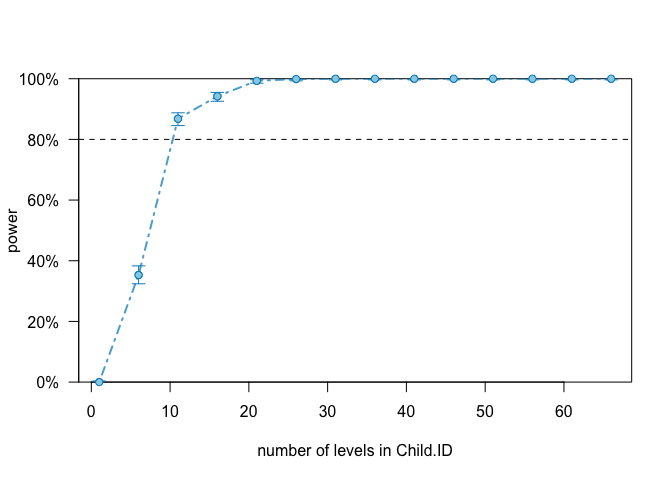

``` r
#around 10 participants

#verbalIQ1:MOT_MLU
pc2.1 <- powerCurve(THEmodel_fix_extend, fixed("verbalIQ1:MOT_MLU"), along = "Child.ID", breaks = seq(from = 1, to = 150, by = 10), nsim = 1000, seed = 1, progress = F)
pc2.1
```

    ## Power for predictor 'verbalIQ1:MOT_MLU', (95% confidence interval),
    ## by number of levels in Child.ID:
    ##       1:  0.00% ( 0.00,  0.37) - 6 rows
    ##      11: 13.40% (11.35, 15.67) - 62 rows
    ##      21: 21.20% (18.70, 23.87) - 121 rows
    ##      31: 23.10% (20.52, 25.84) - 180 rows
    ##      41: 31.20% (28.34, 34.17) - 238 rows
    ##      51: 42.10% (39.02, 45.23) - 295 rows
    ##      61: 49.40% (46.26, 52.55) - 357 rows
    ##      71: 56.50% (53.36, 59.60) - 416 rows
    ##      81: 59.80% (56.69, 62.86) - 473 rows
    ##      91: 65.30% (62.26, 68.25) - 532 rows
    ##     101: 67.70% (64.70, 70.59) - 591 rows
    ##     111: 70.90% (67.98, 73.70) - 647 rows
    ##     121: 77.50% (74.78, 80.05) - 705 rows
    ##     131: 80.50% (77.91, 82.91) - 768 rows
    ##     141: 84.00% (81.58, 86.22) - 824 rows
    ## 
    ## Time elapsed: 0 h 41 m 11 s

``` r
plot(pc2.1)
```

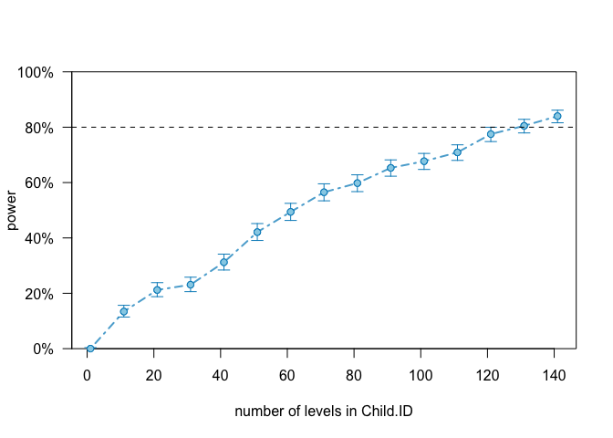

``` r
#around 130 participants

#Visit
pc3.1 <- powerCurve(THEmodel1_fix, fixed("Visit"), along = "Child.ID", nsim = 1000, breaks = seq(from = 1, to = 70, by = 5), seed = 1, progress = F)
pc3.1
```

    ## Power for predictor 'Visit', (95% confidence interval),
    ## by number of levels in Child.ID:
    ##       1:  0.00% ( 0.00,  0.37) - 6 rows
    ##       6: 78.20% (75.51, 80.72) - 35 rows
    ##      11: 95.30% (93.80, 96.53) - 62 rows
    ##      16: 99.30% (98.56, 99.72) - 92 rows
    ##      21: 99.90% (99.44, 100.00) - 121 rows
    ##      26: 100.0% (99.63, 100.0) - 150 rows
    ##      31: 100.0% (99.63, 100.0) - 180 rows
    ##      36: 100.0% (99.63, 100.0) - 210 rows
    ##      41: 100.0% (99.63, 100.0) - 238 rows
    ##      46: 100.0% (99.63, 100.0) - 266 rows
    ##      51: 100.0% (99.63, 100.0) - 295 rows
    ##      56: 100.0% (99.63, 100.0) - 322 rows
    ##      61: 100.0% (99.63, 100.0) - 357 rows
    ##      66: 100.0% (99.63, 100.0) - 387 rows
    ## 
    ## Time elapsed: 0 h 20 m 35 s

``` r
plot(pc3.1)
```

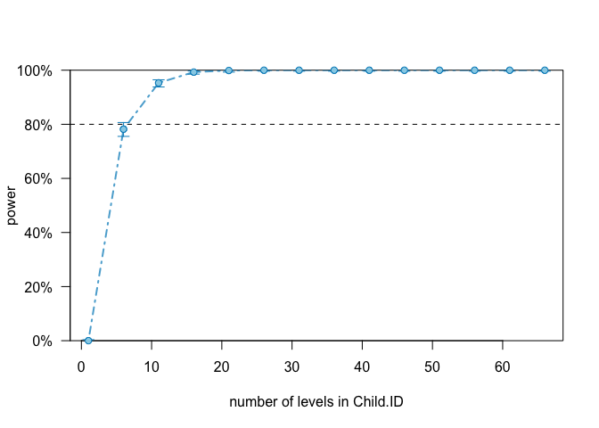

``` r
#around 8 participants

#Diagnosis
pc4.1 <- powerCurve(THEmodel1_fix_extend, fixed("Diagnosis"), along = "Child.ID", nsim = 1000, breaks = seq(from = 1, to = 150, by = 5), seed = 1, progress = F)
pc4.1
```

    ## Power for predictor 'Diagnosis', (95% confidence interval),
    ## by number of levels in Child.ID:
    ##       1:  0.00% ( 0.00,  0.37) - 6 rows
    ##       6: 13.60% (11.54, 15.88) - 35 rows
    ##      11: 23.70% (21.09, 26.46) - 62 rows
    ##      16: 24.80% (22.15, 27.60) - 92 rows
    ##      21: 35.40% (32.43, 38.45) - 121 rows
    ##      26: 42.70% (39.61, 45.83) - 150 rows
    ##      31: 49.30% (46.16, 52.45) - 180 rows
    ##      36: 53.10% (49.95, 56.23) - 210 rows
    ##      41: 55.70% (52.56, 58.81) - 238 rows
    ##      46: 59.70% (56.59, 62.76) - 266 rows
    ##      51: 62.90% (59.82, 65.90) - 295 rows
    ##      56: 66.50% (63.48, 69.42) - 322 rows
    ##      61: 69.30% (66.34, 72.15) - 357 rows
    ##      66: 74.90% (72.09, 77.56) - 387 rows
    ##      71: 78.30% (75.61, 80.82) - 416 rows
    ##      76: 80.40% (77.80, 82.82) - 443 rows
    ##      81: 82.00% (79.48, 84.33) - 473 rows
    ##      86: 84.50% (82.11, 86.69) - 502 rows
    ##      91: 85.30% (82.95, 87.44) - 532 rows
    ##      96: 89.40% (87.32, 91.24) - 561 rows
    ##     101: 90.20% (88.19, 91.97) - 591 rows
    ##     106: 91.80% (89.92, 93.43) - 619 rows
    ##     111: 93.20% (91.46, 94.68) - 647 rows
    ##     116: 94.00% (92.34, 95.39) - 676 rows
    ##     121: 93.90% (92.23, 95.30) - 705 rows
    ##     126: 95.00% (93.46, 96.27) - 733 rows
    ##     131: 96.00% (94.59, 97.13) - 768 rows
    ##     136: 96.70% (95.40, 97.72) - 797 rows
    ##     141: 97.10% (95.86, 98.05) - 824 rows
    ##     146: 97.30% (96.10, 98.21) - 854 rows
    ## 
    ## Time elapsed: 0 h 19 m 17 s

``` r
plot(pc4.1)
```

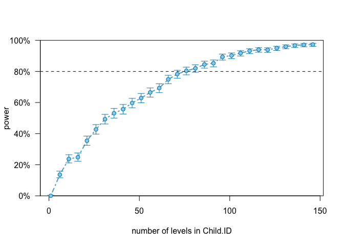

``` r
#around 75 participants

#verbalIQ1
pc5.1 <- powerCurve(THEmodel1_fix, fixed("verbalIQ1"), along = "Child.ID", nsim = 1000, breaks = seq(from = 1, to = 70, by = 5), seed = 1, progress = F)
pc5.1
```

    ## Power for predictor 'verbalIQ1', (95% confidence interval),
    ## by number of levels in Child.ID:
    ##       1:  0.00% ( 0.00,  0.37) - 6 rows
    ##       6:  9.80% ( 8.03, 11.81) - 35 rows
    ##      11: 54.20% (51.05, 57.32) - 62 rows
    ##      16: 68.30% (65.32, 71.18) - 92 rows
    ##      21: 96.80% (95.51, 97.80) - 121 rows
    ##      26: 99.30% (98.56, 99.72) - 150 rows
    ##      31: 99.40% (98.70, 99.78) - 180 rows
    ##      36: 99.60% (98.98, 99.89) - 210 rows
    ##      41: 99.70% (99.13, 99.94) - 238 rows
    ##      46: 99.80% (99.28, 99.98) - 266 rows
    ##      51: 99.90% (99.44, 100.00) - 295 rows
    ##      56: 100.0% (99.63, 100.0) - 322 rows
    ##      61: 100.0% (99.63, 100.0) - 357 rows
    ##      66: 100.0% (99.63, 100.0) - 387 rows
    ## 
    ## Time elapsed: 0 h 20 m 7 s

``` r
plot(pc5.1)
```

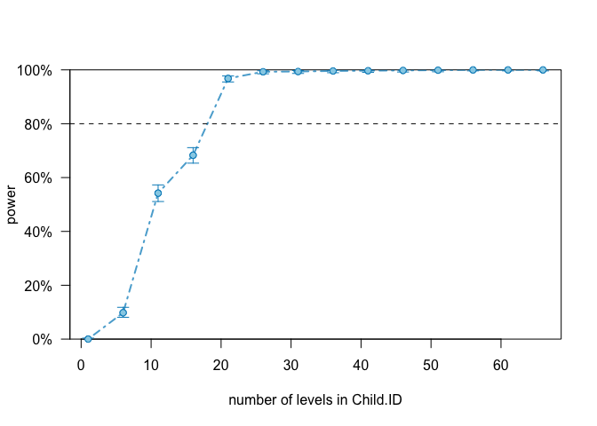

``` r
#around 19 participants

#MOT_MLU
pc6.1 <- powerCurve(THEmodel1_fix, fixed("MOT_MLU"), along = "Child.ID", nsim = 1000, breaks = seq(from = 1, to = 70, by = 5), seed = 1, progress = F)
pc6.1
```

    ## Power for predictor 'MOT_MLU', (95% confidence interval),
    ## by number of levels in Child.ID:
    ##       1:  0.00% ( 0.00,  0.37) - 6 rows
    ##       6: 30.10% (27.27, 33.05) - 35 rows
    ##      11: 66.80% (63.78, 69.72) - 62 rows
    ##      16: 78.90% (76.24, 81.39) - 92 rows
    ##      21: 92.80% (91.02, 94.32) - 121 rows
    ##      26: 96.00% (94.59, 97.13) - 150 rows
    ##      31: 97.10% (95.86, 98.05) - 180 rows
    ##      36: 98.50% (97.54, 99.16) - 210 rows
    ##      41: 98.70% (97.79, 99.31) - 238 rows
    ##      46: 99.50% (98.84, 99.84) - 266 rows
    ##      51: 99.50% (98.84, 99.84) - 295 rows
    ##      56: 99.80% (99.28, 99.98) - 322 rows
    ##      61: 99.80% (99.28, 99.98) - 357 rows
    ##      66: 100.0% (99.63, 100.0) - 387 rows
    ## 
    ## Time elapsed: 0 h 19 m 46 s

``` r
plot(pc6.1)
```

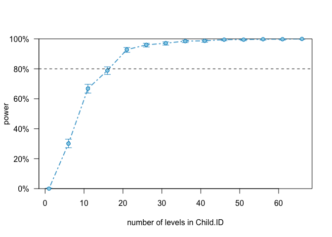

``` r
#around  participants
```

### Exercise 3

Assume you have only the resources to collect 30 kids (15 with ASD and 15 TDs). Identify the power for each relevant effect and discuss whether it's worth to run the study and why

``` r
pc1.1 #Visit:Diagnosis 100% for 30 
```

    ## Power for predictor 'Visit:Diagnosis', (95% confidence interval),
    ## by number of levels in Child.ID:
    ##       1:  0.00% ( 0.00,  0.37) - 6 rows
    ##       6: 35.30% (32.33, 38.35) - 35 rows
    ##      11: 86.80% (84.54, 88.84) - 62 rows
    ##      16: 94.20% (92.57, 95.57) - 92 rows
    ##      21: 99.30% (98.56, 99.72) - 121 rows
    ##      26: 99.90% (99.44, 100.00) - 150 rows
    ##      31: 100.0% (99.63, 100.0) - 180 rows
    ##      36: 100.0% (99.63, 100.0) - 210 rows
    ##      41: 100.0% (99.63, 100.0) - 238 rows
    ##      46: 100.0% (99.63, 100.0) - 266 rows
    ##      51: 100.0% (99.63, 100.0) - 295 rows
    ##      56: 100.0% (99.63, 100.0) - 322 rows
    ##      61: 100.0% (99.63, 100.0) - 357 rows
    ##      66: 100.0% (99.63, 100.0) - 387 rows
    ## 
    ## Time elapsed: 0 h 36 m 40 s

``` r
pc2.1 #verbalIQ1:MOT_MLU 23% for 30
```

    ## Power for predictor 'verbalIQ1:MOT_MLU', (95% confidence interval),
    ## by number of levels in Child.ID:
    ##       1:  0.00% ( 0.00,  0.37) - 6 rows
    ##      11: 13.40% (11.35, 15.67) - 62 rows
    ##      21: 21.20% (18.70, 23.87) - 121 rows
    ##      31: 23.10% (20.52, 25.84) - 180 rows
    ##      41: 31.20% (28.34, 34.17) - 238 rows
    ##      51: 42.10% (39.02, 45.23) - 295 rows
    ##      61: 49.40% (46.26, 52.55) - 357 rows
    ##      71: 56.50% (53.36, 59.60) - 416 rows
    ##      81: 59.80% (56.69, 62.86) - 473 rows
    ##      91: 65.30% (62.26, 68.25) - 532 rows
    ##     101: 67.70% (64.70, 70.59) - 591 rows
    ##     111: 70.90% (67.98, 73.70) - 647 rows
    ##     121: 77.50% (74.78, 80.05) - 705 rows
    ##     131: 80.50% (77.91, 82.91) - 768 rows
    ##     141: 84.00% (81.58, 86.22) - 824 rows
    ## 
    ## Time elapsed: 0 h 41 m 11 s

``` r
pc3.1 #Visit #100% for 30
```

    ## Power for predictor 'Visit', (95% confidence interval),
    ## by number of levels in Child.ID:
    ##       1:  0.00% ( 0.00,  0.37) - 6 rows
    ##       6: 78.20% (75.51, 80.72) - 35 rows
    ##      11: 95.30% (93.80, 96.53) - 62 rows
    ##      16: 99.30% (98.56, 99.72) - 92 rows
    ##      21: 99.90% (99.44, 100.00) - 121 rows
    ##      26: 100.0% (99.63, 100.0) - 150 rows
    ##      31: 100.0% (99.63, 100.0) - 180 rows
    ##      36: 100.0% (99.63, 100.0) - 210 rows
    ##      41: 100.0% (99.63, 100.0) - 238 rows
    ##      46: 100.0% (99.63, 100.0) - 266 rows
    ##      51: 100.0% (99.63, 100.0) - 295 rows
    ##      56: 100.0% (99.63, 100.0) - 322 rows
    ##      61: 100.0% (99.63, 100.0) - 357 rows
    ##      66: 100.0% (99.63, 100.0) - 387 rows
    ## 
    ## Time elapsed: 0 h 20 m 35 s

``` r
pc4.1 #Diagnosis 49% for 30 
```

    ## Power for predictor 'Diagnosis', (95% confidence interval),
    ## by number of levels in Child.ID:
    ##       1:  0.00% ( 0.00,  0.37) - 6 rows
    ##       6: 13.60% (11.54, 15.88) - 35 rows
    ##      11: 23.70% (21.09, 26.46) - 62 rows
    ##      16: 24.80% (22.15, 27.60) - 92 rows
    ##      21: 35.40% (32.43, 38.45) - 121 rows
    ##      26: 42.70% (39.61, 45.83) - 150 rows
    ##      31: 49.30% (46.16, 52.45) - 180 rows
    ##      36: 53.10% (49.95, 56.23) - 210 rows
    ##      41: 55.70% (52.56, 58.81) - 238 rows
    ##      46: 59.70% (56.59, 62.76) - 266 rows
    ##      51: 62.90% (59.82, 65.90) - 295 rows
    ##      56: 66.50% (63.48, 69.42) - 322 rows
    ##      61: 69.30% (66.34, 72.15) - 357 rows
    ##      66: 74.90% (72.09, 77.56) - 387 rows
    ##      71: 78.30% (75.61, 80.82) - 416 rows
    ##      76: 80.40% (77.80, 82.82) - 443 rows
    ##      81: 82.00% (79.48, 84.33) - 473 rows
    ##      86: 84.50% (82.11, 86.69) - 502 rows
    ##      91: 85.30% (82.95, 87.44) - 532 rows
    ##      96: 89.40% (87.32, 91.24) - 561 rows
    ##     101: 90.20% (88.19, 91.97) - 591 rows
    ##     106: 91.80% (89.92, 93.43) - 619 rows
    ##     111: 93.20% (91.46, 94.68) - 647 rows
    ##     116: 94.00% (92.34, 95.39) - 676 rows
    ##     121: 93.90% (92.23, 95.30) - 705 rows
    ##     126: 95.00% (93.46, 96.27) - 733 rows
    ##     131: 96.00% (94.59, 97.13) - 768 rows
    ##     136: 96.70% (95.40, 97.72) - 797 rows
    ##     141: 97.10% (95.86, 98.05) - 824 rows
    ##     146: 97.30% (96.10, 98.21) - 854 rows
    ## 
    ## Time elapsed: 0 h 19 m 17 s

``` r
pc5.1 #verbalIQ1 99% for 30 
```

    ## Power for predictor 'verbalIQ1', (95% confidence interval),
    ## by number of levels in Child.ID:
    ##       1:  0.00% ( 0.00,  0.37) - 6 rows
    ##       6:  9.80% ( 8.03, 11.81) - 35 rows
    ##      11: 54.20% (51.05, 57.32) - 62 rows
    ##      16: 68.30% (65.32, 71.18) - 92 rows
    ##      21: 96.80% (95.51, 97.80) - 121 rows
    ##      26: 99.30% (98.56, 99.72) - 150 rows
    ##      31: 99.40% (98.70, 99.78) - 180 rows
    ##      36: 99.60% (98.98, 99.89) - 210 rows
    ##      41: 99.70% (99.13, 99.94) - 238 rows
    ##      46: 99.80% (99.28, 99.98) - 266 rows
    ##      51: 99.90% (99.44, 100.00) - 295 rows
    ##      56: 100.0% (99.63, 100.0) - 322 rows
    ##      61: 100.0% (99.63, 100.0) - 357 rows
    ##      66: 100.0% (99.63, 100.0) - 387 rows
    ## 
    ## Time elapsed: 0 h 20 m 7 s

``` r
pc6.1 #MOT_MLU 98% for 30 
```

    ## Power for predictor 'MOT_MLU', (95% confidence interval),
    ## by number of levels in Child.ID:
    ##       1:  0.00% ( 0.00,  0.37) - 6 rows
    ##       6: 30.10% (27.27, 33.05) - 35 rows
    ##      11: 66.80% (63.78, 69.72) - 62 rows
    ##      16: 78.90% (76.24, 81.39) - 92 rows
    ##      21: 92.80% (91.02, 94.32) - 121 rows
    ##      26: 96.00% (94.59, 97.13) - 150 rows
    ##      31: 97.10% (95.86, 98.05) - 180 rows
    ##      36: 98.50% (97.54, 99.16) - 210 rows
    ##      41: 98.70% (97.79, 99.31) - 238 rows
    ##      46: 99.50% (98.84, 99.84) - 266 rows
    ##      51: 99.50% (98.84, 99.84) - 295 rows
    ##      56: 99.80% (99.28, 99.98) - 322 rows
    ##      61: 99.80% (99.28, 99.98) - 357 rows
    ##      66: 100.0% (99.63, 100.0) - 387 rows
    ## 
    ## Time elapsed: 0 h 19 m 46 s
